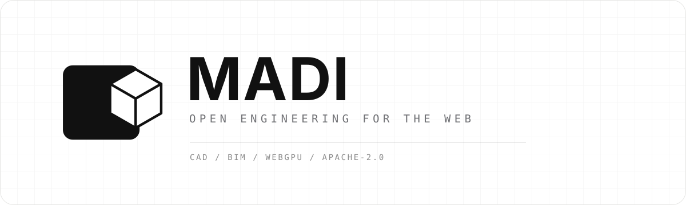
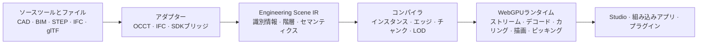

  

  <a href="README.md">English</a> ·
  <a href="README.ko.md">한국어</a> ·
  <strong>日本語</strong> ·
  <a href="README.zh-CN.md">简体中文</a>

  
  
  
  

  <strong>既存のツールを置き換えることなく、エンジニアリングモデルをWebへ。</strong>
   
  大規模なCAD・BIM・エンジニアリングシーンのための、オープンソースのスタジオ、コンパイラ、WebGPUランタイムです。

> [!IMPORTANT]
> MADIは現在、アーキテクチャ設計とプロトタイピングの段階です。この
> リポジトリは製品、システム境界、ベンチマーク、実装方針を定義するもので、
> インストール可能な本番ビューアはまだ含まれていません。

> この文書は英語版 [`README.md`](README.md) の翻訳です。内容に差異がある
> 場合は英語版を正とします。用語や表現のレビューを歓迎します。

## エンジニアリングモデルにも、オープンなWebプラットフォームを

エンジニアリングチームは、SolidWorks、CATIA、NX、Creo、Fusion、
Onshape、Revitなどの専門システムですでに正式なデータを作成しています。
難しいのは、新しいCADファイル形式を発明することではありません。
アセンブリの識別情報やエンジニアリング上の意味を失わずに、そのデータを
ブラウザで高速に表示・検査・自動化し、他の製品へ組み込むことです。

MADIはソースツールとWebアプリケーションの間にオープンなレイヤーを
提供します。長期的にはBlenderのように、強力なコアと幅広い拡張
エコシステムをコミュニティで育てるエンジニアリングワークスペースを
目指します。まずは、大規模シーンの配信と操作に集中します。

<table>
  <tr>
    <td width="33%" valign="top">
      <h3>原本を正とする</h3>
      ネイティブCAD/BIMと中間交換ファイルは引き続きsource of truthです。
      MADIワークスペースが保存するのは参照、ビュー、注釈、プラグイン状態であり、
      代替CAD形式ではありません。
    </td>
    <td width="33%" valign="top">
      <h3>大規模シーン向けにコンパイル</h3>
      オフラインパイプラインはoccurrenceとソース参照を保ちながら、
      インスタンシング、分割、量子化、圧縮、段階的LODを構築します。
    </td>
    <td width="33%" valign="top">
      <h3>WebGPUネイティブで実行</h3>
      パックされたデータ、メモリ制限、Worker、GPU可視状態、直接WebGPU
      レンダリングにより、大規模なJavaScript scene graphをフレームの
      hot pathから切り離します。
    </td>
  </tr>
</table>

## ひとつのオープンパイプライン

Engineering Scene IRは新しい交換形式ではなく、論理的なシステム境界です。
配信には適合する既存標準を優先し、公開ベンチマークで明確な差が確認された
場合にのみ、最適化されたコンパイル済みキャッシュを導入します。

## 構築するもの

| レイヤー | 役割 | 最初の垂直スライス |
|---|---|---|
| **MADI Studio** | リファレンスとなるエンジニアリングワークスペース | アセンブリツリー、検索、プロパティ、選択、表示/分離、断面、計測 |
| **MADI Runtime** | Headlessブラウザ・GPUエンジン | 段階的ストリーミング、Workerデコード、インスタンシング、カリング、ピッキング、GPUメモリ制限 |
| **MADI Compiler** | 再現可能なsource-to-Webビルドパイプライン | OCCT経由のSTEP AP242、階層・エッジ保持、LOD・チャンク生成 |
| **MADI SDK** | 安定した組み込み・拡張インターフェース | フレームワーク非依存TypeScript API、コマンド、パネル、解析Worker、権限ベースのプラグイン |

### エンジニアリング作業のための設計

- アセンブリ、prototype、occurrence、ソースオブジェクト、名前、色、単位、変換の関係を保持
- 三角形から境界を推測するのではなく、明示的なCADエッジを描画
- 目標精度の全形状を待たず、操作可能な粗いシーンを先に表示
- 安定したオブジェクトIDによる選択、非表示、分離、クリップ、計測、注釈
- 非常に大きなシーンでも、宣言したCPU/GPUメモリ予算を維持
- Studioのセルフホスト、または他製品へのランタイム組み込み

## プロジェクトの状態

ロードマップは日付ではなく、検証可能な成果を基準に進みます。

| フェーズ | 成果 | 状態 |
|---|---|---|
| **0 — 実現性検証** | OCCTの識別情報・エッジを直接WebGPUプロトタイプへ接続 | **完了** |
| **1 — 垂直スライス** | 基本的なエンジニアリング操作を備えた公開STEP-to-browserデモ | **現在** |
| **2 — 大規模シーンalpha** | 10万以上のoccurrence、ストリーミング、LOD、キャッシュ、メモリ予算 | 予定 |
| **3 — オープンプラットフォームbeta** | プラグイン、IFC、組み込み例、セルフホスト配布 | 予定 |

詳しくは[ロードマップ](docs/ROADMAP.md)、[Phase 1進捗](docs/PHASE_1.md)、
[ベンチマーク仕様](docs/BENCHMARKS.md)をご覧ください。性能値は再配布可能な
モデル、正確なハードウェア・ブラウザ情報、cold/warm状態、再現コマンドと
ともに公開します。

## 現在のランタイム検証

標準デモは合成マスコットではなく、実在するAdafruit PyGamer電子機器
アセンブリを使用します。34個の共有mesh、85個のpart occurrence、162,838
個の固有triangle、13,897個の明示的CAD edge、Worker decode、ソース参照を
保持したjoystick pickingをChromeとFirefoxで検証しました。未変更のCADは
固定upstream commitと通知を保持してMITで再配布しており、Adafruitによる
MADIの推奨を意味しません。[検証済みブラウザ証拠](artifacts/browser-matrix/README.md)を
参照してください。

## 設計から読み始める

| 知りたいこと | 文書 |
|---|---|
| 製品の最初の焦点と対象ワークフロー | [製品計画](docs/PRODUCT.md) |
| システム境界とデータフロー | [システムアーキテクチャ](docs/ARCHITECTURE.md) |
| 中立的なシーンデータモデル | [Engineering Scene IR](docs/SCENE_IR.md) |
| STEP/OCCTの入力とコンパイル | [コンパイラ設計](docs/COMPILER.md) |
| ブラウザのスケジューリングとWebGPU描画 | [ランタイム設計](docs/RUNTIME.md) |
| 拡張機能や組み込み製品 | [プラグインアーキテクチャ](docs/PLUGINS.md) |
| 基盤となる技術判断 | [Architecture Decision Records](docs/adr/README.md) |

すべての設計文書は [`docs/README.md`](docs/README.md) にまとまっています。

## 原則

1. **ソースツールを正とします。** 形式移行を強制せず、既存の
   エンジニアリングシステムを補完します。
2. **セマンティクスと描画形状を分離します。** 最高精度の形状がメモリに
   なくても、オブジェクトの検索と照会ができます。
3. **単なる変換ではなく、コンパイルします。** ブラウザの起動時間、メモリ、
   帯域、描画オーバーヘッドを減らす処理をオフラインで行います。
4. **最初の1バイトから段階的に表示します。** 最初の有用な操作までの時間を
   主要指標とします。
5. **Hot pathはdata-orientedです。** フレームごとの処理にはパック配列、
   バッチ、GPU可視状態を使用します。
6. **標準を優先し、根拠で決めます。** 独自の配信構造には測定された理由と
   互換性方針が必要です。
7. **ランタイムはカーネル非依存です。** OCCTと商用変換SDKはアダプターの
   背後に留まり、ブラウザ公開APIへ漏れません。
8. **オープンで組み込み可能にします。** コア部品はStudio UIなしでも利用できます。

## よくある質問

<strong>MADIは新しいCADファイル形式ですか？</strong>

 
いいえ。既存のCAD/BIM文書がsource of truthです。MADIは中立的な
インメモリ境界を定義し、ブラウザ配信用に最適化した、破棄・再生成可能な
バージョン付きキャッシュを作成できます。

<strong>Fusion、Onshape、デスクトップCADを置き換えるのですか？</strong>

 
初期スコープでは置き換えません。最初の製品は、大規模シーン向けの
エンジニアリングワークスペースと組み込み可能なランタイムです。将来、
独立したワークベンチとして精密なパラメトリック編集を追加できますが、
コアプラットフォームの価値に必須ではありません。

<strong>なぜOCCTと直接WebGPUランタイムを組み合わせるのですか？</strong>

 
Open CASCADEは、精密形状、アセンブリ、ソースエッジを読むための成熟した
オフライン経路を提供します。ブラウザランタイムの役割は、コンパイル済み
シーンを効率的にストリーミングし操作することです。境界を分離することで、
形状カーネルを描画hot pathへ持ち込まずに済みます。

<strong>なぜビューア全体をThree.jsで作らないのですか？</strong>

 
Three.jsは周辺ツールや実験で引き続き有用です。MADIの大規模シーン
レンダラーは、バッチング、residency、ピッキング、メモリ方針を明示的に
制御するため、直接WebGPUデータ構造を使います。これはアーキテクチャ上の
焦点であり、汎用scene graphを否定するものではありません。

<strong>glTFはどこで使われますか？</strong>

 
glTFは重要な標準ベースの配信・相互運用手段です。エンジニアリング上の
識別情報、エッジ、ストリーミング、精度要件を満たす範囲で、glTF、meshopt、
KTX2、3D Tilesの概念、メタデータ標準を再利用します。最初のPhase 1
コンパイラースライスはglTF 2.0と外部バイナリを生成します。ブラウザーは
階層を先に開き、Workerでジオメトリをデコードします。MADIの識別情報と
ソース対応は、明示的に実験段階の`extras`へ保持します。

## コントリビューション

MADIは、根拠によってアーキテクチャを変えられる初期段階にあります。
現在、特に価値のあるコントリビューションは次のとおりです。

- エッジケースを文書化した再配布可能なSTEP・IFCテストモデル
- OCCT抽出やWebGPU描画の技術検証
- ベンチマークハーネスと透明性のある基準結果
- 識別情報、精度、キャッシュ、プラグイン判断のレビュー
- 実際のエンジニアリングチームの製品ワークフロー
- 文書と翻訳のレビュー

[CONTRIBUTING.md](CONTRIBUTING.md)を読み、
[未解決のIssue](https://github.com/1n01raymond/madi/issues)を確認するか、
[翻訳](docs/TRANSLATIONS.md)を改善してください。大きな変更は、実装前に
前提と方向性を共有できるよう、設計Issueから始めることを推奨します。

## ライセンス

MADIは [Apache License 2.0](LICENSE) で提供されます。予定している
サードパーティ依存関係は、互換性のある別ライセンスを使用する場合があります。
詳しくは [THIRD_PARTY.md](THIRD_PARTY.md) をご覧ください。

  Webのためのオープンエンジニアリング。

