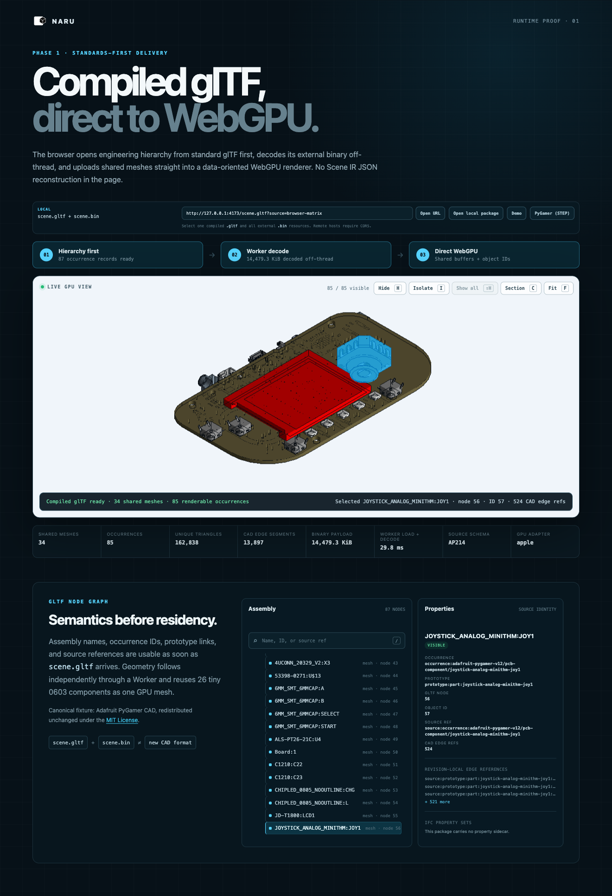
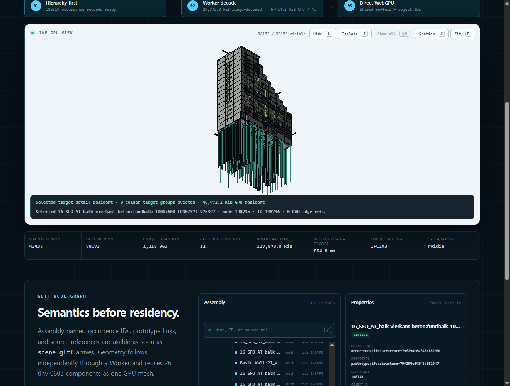
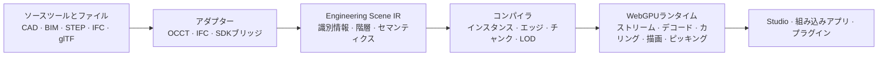

<p align="center">
  
</p>

<p align="center">
  <a href="README.md">English</a> ·
  <a href="README.ko.md">한국어</a> ·
  <strong>日本語</strong> ·
  <a href="README.zh-CN.md">简体中文</a>
</p>

<p align="center">
  <a href="LICENSE"></a>
  
  
  <a href="CONTRIBUTING.md"></a>
</p>

<p align="center">
  <strong>既存のツールを置き換えることなく、エンジニアリングモデルをWebへ。</strong>
  <br />
  大規模なCAD・BIM・エンジニアリングシーンのための、オープンソースのスタジオ、コンパイラ、WebGPUランタイムです。
</p>

> [!IMPORTANT]
> NARUは現在、アーキテクチャ設計とプロトタイピングの段階です。この
> リポジトリは製品、システム境界、ベンチマーク、実装方針を定義するもので、
> インストール可能な本番ビューアはまだ含まれていません。

> この文書は英語版 [`README.md`](README.md) の翻訳です。内容に差異がある
> 場合は英語版を正とします。用語や表現のレビューを歓迎します。

## いま実際にブラウザで動くもの

以下はモックアップでもロードマップ項目でもありません。すべての数値はCIが
再検証するコミット済みの証拠記録につながっており、スクリーンショットは
その記録がダイジェストで固定したキャプチャそのものです。

<table>
  <tr>
    <td width="50%" valign="top">
      <a href="artifacts/browser-matrix/README.md">
        
      </a>
      <br />
      <sub><strong>実在するSTEPアセンブリを、最後まで。</strong> Adafruit
      PyGamerボード:34個のmeshを共有する85個のpart occurrence、162,838個の
      固有triangle、13,897個の明示的CAD edge segment、ソース参照を保持した
      joystick picking — ChromeとFirefoxで同一の挙動です。
      <a href="artifacts/browser-matrix/README.md">ブラウザ証拠</a></sub>
    </td>
    <td width="50%" valign="top">
      <a href="artifacts/ifc/sixty5-first-frame/README.md">
        
      </a>
      <br />
      <sub><strong>実物大のIFC federation。</strong> 839.9 MB・7分野の
      <code>sixty5</code>モデル:2.2秒で階層と検索が準備完了、描画可能な
      78,173個のoccurrence全体の初回coarse frameが4.2秒、geometryは固定
      64 MiB予算内に維持、選択した基礎梁が自身のIFCプロパティをresolve
      します。
      <a href="artifacts/ifc/sixty5-browser/README.md">residency証拠</a> ·
      <a href="artifacts/ifc/sixty5-first-frame/README.md">初回フレーム証拠</a></sub>
    </td>
  </tr>
</table>

<sub>PyGamerのCADの著作権はAdafruit Industriesにあり、固定upstream commitと
通知を保持して未変更のままMITで再配布しています。AdafruitによるNARUの推奨を
意味しません。</sub>

## この証拠があなたのモデルに意味すること

| 得られるもの | 測定された根拠 |
|---|---|
| 繰り返し部品は重複せず一度だけ保存・アップロードされます | 85個のoccurrenceが34個のmeshを共有 ([ブラウザmatrix](artifacts/browser-matrix/README.md)) |
| CAD境界は三角形から推測せず、ソースのedgeから描画します | 13,897個の明示的edge segmentがブラウザまで維持 ([ブラウザmatrix](artifacts/browser-matrix/README.md)) |
| ツリー・検索・プロパティはgeometryの到着前に動作します | 839.9 MBのfederationで188,319レコードの階層が3.3秒で準備完了 ([sixty5ブラウザ記録](artifacts/ifc/sixty5-browser/README.md)) |
| 詳細形状はプレーンなHTTP上で漸進的にストリーミングされます | 28件の`scene.bin`リクエストがすべてHTTP 206 `bytes=` Range応答 ([sixty5ブラウザ記録](artifacts/ifc/sixty5-browser/README.md)) |
| シーン規模によらずメモリは宣言された予算内に収まります | promotionは234個中26番目のchunkで停止、デコード・GPUバイトとも64 MiB未満を維持 ([sixty5ブラウザ記録](artifacts/ifc/sixty5-browser/README.md)) |
| 選択はソースCAD/BIM識別子へ解決されます | 選択した基礎梁が6件のIFCプロパティ項目を遅延resolve ([sixty5ブラウザ記録](artifacts/ifc/sixty5-browser/README.md)) |
| 実物大の初回フレームは分ではなく秒単位で到着します | 共有coarse Worker経路と仮想化されたアセンブリ一覧がsixty5の初回coarse frameを268.0秒から中央値4.2秒へ短縮 — 63.2倍の高速化 ([初回フレーム記録](artifacts/ifc/sixty5-first-frame/README.md)) |
| カメラ移動は古いダウンロードを待たずにキャンセルします | 不要になったfastener Rangeリクエストが中断され、新たに見えるmounting-plate Rangeが先に発行 — ChromeとFirefoxで同一 ([ブラウザmatrix](artifacts/browser-matrix/README.md)) |
| 原点から10,000 km離れた座標でも精度を維持します | 0.25 mmの板間隔が誤差0.001 mm以下でコンパイルされ、両エンジンともピクセルドリフト0で描画 ([精度記録](artifacts/precision/large-coordinates/README.md)) |
| 近接するgeometryがまとまって転送されるようパッケージをパッキングできます (opt-in) | leaf-anchor payload順序がDigital Hub censusでoff-viewバイト合計を39.9%削減 ([spatial demand記録](artifacts/spatial-demand/README.md)) |
| コンパイルはバイト単位で再現可能です | 2回の完全なsixty5コンパイルがバイト同一のパッケージを生成 ([コンパイル証拠](artifacts/ifc/sixty5/README.md)) |
| **まだ達成していないこと:** 実物大スケールでのインタラクティブ級のready状態とブラウザ間性能主張 | 4.2秒の初回フレームはdiscrete GPUホスト1台での単一Chrome記録であり、予算制限ready状態は依然15.8秒 ([初回フレーム記録](artifacts/ifc/sixty5-first-frame/README.md)) |

## どこから始めるか

| やりたいこと | 開始地点 |
|---|---|
| モデルが動くところを見る | Digital Hubを読み込んだ[公開Studioデモ](https://1n01raymond.github.io/naru/)を開くか、`pnpm install && pnpm dev`でPyGamerアセンブリをローカル実行します ([Studioガイド](apps/webgpu-spike/README.md)) |
| ビューアを自分のアプリに組み込む | [Runtimeパッケージ](packages/runtime-webgpu/README.md) — コンパイル済みglTFローダーと直接WebGPUレンダラー |
| 自分のSTEP・IFCをコンパイルする | [Compilerパッケージ](packages/compiler/README.md)と下記の[コンパイラ検証](#現在のコンパイラ検証) |
| アーキテクチャを理解する | 読む順序で整理された[設計文書](docs/README.md) |
| コントリビュートする・決定に異議を唱える | [CONTRIBUTING.md](CONTRIBUTING.md)と[ADR索引](docs/adr/README.md) |

## エンジニアリングモデルにも、オープンなWebプラットフォームを

エンジニアリングチームは、SolidWorks、CATIA、NX、Creo、Fusion、
Onshape、Revitなどの専門システムですでに正式なデータを作成しています。
難しいのは、新しいCADファイル形式を発明することではありません。
アセンブリの識別情報やエンジニアリング上の意味を失わずに、そのデータを
ブラウザで高速に表示・検査・自動化し、他の製品へ組み込むことです。

NARUはソースツールとWebアプリケーションの間にオープンなレイヤーを
提供します。長期的にはBlenderのように、強力なコアと幅広い拡張
エコシステムをコミュニティで育てるエンジニアリングワークスペースを
目指します。まずは、大規模シーンの配信と操作に集中します。

<table>
  <tr>
    <td width="33%" valign="top">
      <h3>原本を正とする</h3>
      ネイティブCAD/BIMと中間交換ファイルは引き続きsource of truthです。
      NARUワークスペースが保存するのは参照、ビュー、注釈、プラグイン状態であり、
      代替CAD形式ではありません。
    </td>
    <td width="33%" valign="top">
      <h3>大規模シーン向けにコンパイル</h3>
      オフラインパイプラインはoccurrenceとソース参照を保ちながら、
      インスタンシング、分割、量子化、圧縮、段階的LODを構築します。
    </td>
    <td width="33%" valign="top">
      <h3>WebGPUネイティブで実行</h3>
      パックされたデータ、メモリ制限、Worker、GPU可視状態、直接WebGPU
      レンダリングにより、大規模なJavaScript scene graphをフレームの
      hot pathから切り離します。
    </td>
  </tr>
</table>

## ひとつのオープンパイプライン



Engineering Scene IRは新しい交換形式ではなく、論理的なシステム境界です。
配信には適合する既存標準を優先し、公開ベンチマークで明確な差が確認された
場合にのみ、最適化されたコンパイル済みキャッシュを導入します。

## 構築するもの

| レイヤー | 役割 | 最初の垂直スライス |
|---|---|---|
| **NARU Studio** | リファレンスとなるエンジニアリングワークスペース | アセンブリツリー、検索、プロパティ、選択、表示/分離、断面、計測 |
| **NARU Runtime** | Headlessブラウザ・GPUエンジン | 段階的ストリーミング、Workerデコード、インスタンシング、カリング、ピッキング、GPUメモリ制限 |
| **NARU Compiler** | 再現可能なsource-to-Webビルドパイプライン | OCCT経由のSTEP AP242、階層・エッジ保持、LOD・チャンク生成 |
| **NARU SDK** | 安定した組み込み・拡張インターフェース | フレームワーク非依存TypeScript API、コマンド、パネル、解析Worker、権限ベースのプラグイン |

### エンジニアリング作業のための設計

- アセンブリ、prototype、occurrence、ソースオブジェクト、名前、色、単位、変換の関係を保持
- 三角形から境界を推測するのではなく、明示的なCADエッジを描画
- 目標精度の全形状を待たず、操作可能な粗いシーンを先に表示
- 安定したオブジェクトIDによる選択、非表示、分離、クリップ、計測、注釈
- 非常に大きなシーンでも、宣言したCPU/GPUメモリ予算を維持
- Studioのセルフホスト、または他製品へのランタイム組み込み

## プロジェクトの状態

ロードマップは日付ではなく、検証可能な成果を基準に進みます。

| フェーズ | 成果 | 状態 |
|---|---|---|
| **0 — 実現性検証** | OCCTの識別情報・エッジを直接WebGPUプロトタイプへ接続 | **完了** |
| **1 — 垂直スライス** | 基本的なエンジニアリング操作を備えた公開STEP-to-browserデモ | **現在** |
| **2 — 大規模シーンalpha** | 10万以上のoccurrence、ストリーミング、LOD、キャッシュ、メモリ予算 | 予定 |
| **3 — オープンプラットフォームbeta** | プラグイン、IFC、組み込み例、セルフホスト配布 | 予定 |

詳しくは[ロードマップ](docs/ROADMAP.md)、[Phase 1証拠](docs/PHASE_1.md)、
[Phase 0記録](docs/PHASE_0.md)、
[Chrome/Firefox WebGPU matrix](artifacts/browser-matrix/README.md)をご覧
ください。性能値は再配布可能なモデル、正確なハードウェア・ブラウザ情報、
cold/warm状態、再現コマンドとともに公開します。

実在の参照ソースは、大きなバイナリをコミットせずにチェックサムで固定される
ようになりました: NIST AP242適合性ケース2件、IFC-Benchの4分野Digital Hub
federation、839.9 MB・7分野の`sixty5` federationが、ファイルごとの固定
ダイジェストで検証されています。`sixty5`のダウンロードは明示的なopt-inの
ままです。[外部fixtureレジストリ](fixtures/external/README.md)をご覧ください。

## 現在のコンパイラ検証

リポジトリには、事前抽出済みScene IRだけでなく、実行可能なローカル
AP242/AP214経路が追加されました。固定されたOCCT Pythonアダプター依存関係を
導入すると、1つのコマンドでSTEPを読み、アセンブリ再利用とCAD edgeを保持し、
ソース識別子を検証して、コンパイル済みglTFペアを出力します。

```sh
python -m pip install -r native/adapter-occt/tools/requirements-evidence.txt
pnpm naru compile fixtures/step/repeated-fasteners-ap242.step \
  --output output/repeated-fasteners-ap242
```

コミット済みAP242結果は、Khronos glTFのerror・warningともに0件です。展開された
Scene IRは一時データであり、NARUファイル形式ではありません。
[コンパイラ証拠](artifacts/phase1/README.md)を参照してください。

同じコンパイラ境界に、初期のマルチドキュメントIFC経路が追加されました。
検証済みDigital Hubスライスは、固定されたIfcOpenShell 0.8.5で建築・暖房・
配管・換気をfederationします: 描画可能な5,152個のoccurrence、3,383個の共有
geometric prototype、913,520個の固有triangle、273,188個のプロパティ値。
ソースとパッケージのハッシュは、Khronos glTFのerror・warning 0件で独立に
検証されています。これは正確性の証拠であり、まだ大規模シーンの性能主張では
ありません。
[IFC federation証拠](artifacts/ifc/digital-hub/README.md)を参照してください。

両コンパイラとも`--cache <dir>`で、変更のないソースを抽出の再実行なしに
検証済みの永続キャッシュから復元します。エントリはソース・アダプター・
コンパイラ・オプションのidentityでキー化され、破損したエントリは完全な
再コンパイルへフォールバックします。固定されたPyGamer STEPフィクスチャと
Digital Hub federationで記録された証拠は、19.9秒・46.3秒のコールドコンパイル
に対し1.7秒・0.5秒のバイト同一ウォーム復元を示します
([キャッシュ証拠](artifacts/cache/README.md)、
[ADR-0009](docs/adr/0009-persistent-compiled-cache.md)、
[インポートとキャッシュ設計](docs/IMPORT_AND_CACHE.md))。

## 設計から読み始める

| 知りたいこと | 文書 |
|---|---|
| 製品の最初の焦点と対象ワークフロー | [製品計画](docs/PRODUCT.md) |
| システム境界とデータフロー | [システムアーキテクチャ](docs/ARCHITECTURE.md) |
| 中立的なシーンデータモデル | [Engineering Scene IR](docs/SCENE_IR.md) |
| STEP/OCCTの入力とコンパイル | [コンパイラ設計](docs/COMPILER.md) |
| ブラウザのスケジューリングとWebGPU描画 | [ランタイム設計](docs/RUNTIME.md) |
| 拡張機能や組み込み製品 | [プラグインアーキテクチャ](docs/PLUGINS.md) |
| 基盤となる技術判断 | [Architecture Decision Records](docs/adr/README.md) |

すべての設計文書は [`docs/README.md`](docs/README.md) にまとまっています。

## 原則

1. **ソースツールを正とします。** 形式移行を強制せず、既存の
   エンジニアリングシステムを補完します。
2. **セマンティクスと描画形状を分離します。** 最高精度の形状がメモリに
   なくても、オブジェクトの検索と照会ができます。
3. **単なる変換ではなく、コンパイルします。** ブラウザの起動時間、メモリ、
   帯域、描画オーバーヘッドを減らす処理をオフラインで行います。
4. **最初の1バイトから段階的に表示します。** 最初の有用な操作までの時間を
   主要指標とします。
5. **Hot pathはdata-orientedです。** フレームごとの処理にはパック配列、
   バッチ、GPU可視状態を使用します。
6. **標準を優先し、根拠で決めます。** 独自の配信構造には測定された理由と
   互換性方針が必要です。
7. **ランタイムはカーネル非依存です。** OCCTと商用変換SDKはアダプターの
   背後に留まり、ブラウザ公開APIへ漏れません。
8. **オープンで組み込み可能にします。** コア部品はStudio UIなしでも利用できます。

## よくある質問

<details>
<summary><strong>NARUは新しいCADファイル形式ですか？</strong></summary>
<br />
いいえ。既存のCAD/BIM文書がsource of truthです。NARUは中立的な
インメモリ境界を定義し、ブラウザ配信用に最適化した、破棄・再生成可能な
バージョン付きキャッシュを作成できます。
</details>

<details>
<summary><strong>Fusion、Onshape、デスクトップCADを置き換えるのですか？</strong></summary>
<br />
初期スコープでは置き換えません。最初の製品は、大規模シーン向けの
エンジニアリングワークスペースと組み込み可能なランタイムです。将来、
独立したワークベンチとして精密なパラメトリック編集を追加できますが、
コアプラットフォームの価値に必須ではありません。
</details>

<details>
<summary><strong>なぜOCCTと直接WebGPUランタイムを組み合わせるのですか？</strong></summary>
<br />
Open CASCADEは、精密形状、アセンブリ、ソースエッジを読むための成熟した
オフライン経路を提供します。ブラウザランタイムの役割は、コンパイル済み
シーンを効率的にストリーミングし操作することです。境界を分離することで、
形状カーネルを描画hot pathへ持ち込まずに済みます。
</details>

<details>
<summary><strong>なぜビューア全体をThree.jsで作らないのですか？</strong></summary>
<br />
Three.jsは周辺ツールや実験で引き続き有用です。NARUの大規模シーン
レンダラーは、バッチング、residency、ピッキング、メモリ方針を明示的に
制御するため、直接WebGPUデータ構造を使います。これはアーキテクチャ上の
焦点であり、汎用scene graphを否定するものではありません。
</details>

<details>
<summary><strong>glTFはどこで使われますか？</strong></summary>
<br />
glTFは重要な標準ベースの配信・相互運用手段です。エンジニアリング上の
識別情報、エッジ、ストリーミング、精度要件を満たす範囲で、glTF、meshopt、
KTX2、3D Tilesの概念、メタデータ標準を再利用します。最初のPhase 1
コンパイラースライスはglTF 2.0と外部バイナリを生成します。ブラウザーは
階層を先に開き、Workerでジオメトリをデコードします。NARUの識別情報と
ソース対応は、明示的に実験段階の`extras`へ保持します。
</details>

## コントリビューション

NARUは、根拠によってアーキテクチャを変えられる初期段階にあります。
現在、特に価値のあるコントリビューションは次のとおりです。

- エッジケースを文書化した再配布可能なSTEP・IFCテストモデル
- OCCT抽出やWebGPU描画の技術検証
- ベンチマークハーネスと透明性のある基準結果
- 識別情報、精度、キャッシュ、プラグイン判断のレビュー
- 実際のエンジニアリングチームの製品ワークフロー
- 文書と翻訳のレビュー

[CONTRIBUTING.md](CONTRIBUTING.md)を読み、
[未解決のIssue](https://github.com/1n01raymond/naru/issues)を確認するか、
[翻訳](docs/TRANSLATIONS.md)を改善してください。大きな変更は、実装前に
前提と方向性を共有できるよう、設計Issueから始めることを推奨します。

## ライセンス

NARUは [Apache License 2.0](LICENSE) で提供されます。予定している
サードパーティ依存関係は、互換性のある別ライセンスを使用する場合があります。
詳しくは [THIRD_PARTY.md](THIRD_PARTY.md) をご覧ください。

<p align="center">
  <sub>大規模CAD・BIMのためのWebGPUネイティブエンジン。</sub>
</p>
