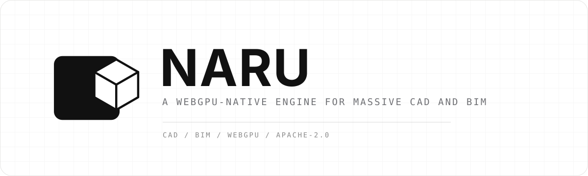

<p align="center">
  
</p>

<p align="center">
  <a href="README.md">English</a> ·
  <strong>한국어</strong> ·
  <a href="README.ja.md">日本語</a> ·
  <a href="README.zh-CN.md">简体中文</a>
</p>

<p align="center">
  <a href="LICENSE"></a>
  
  
  <a href="CONTRIBUTING.md"></a>
</p>

<p align="center">
  <strong>기존 도구를 대체하지 않고, 엔지니어링 모델을 웹으로.</strong>
  <br />
  대형 CAD·BIM·엔지니어링 장면을 위한 오픈소스 스튜디오, 컴파일러, WebGPU 런타임입니다.
</p>

> [!IMPORTANT]
> NARU는 현재 아키텍처 설계 및 프로토타이핑 단계입니다. 이 저장소에는
> 제품 방향, 시스템 경계, 벤치마크와 구현 계획이 담겨 있으며, 아직 설치
> 가능한 프로덕션 뷰어는 없습니다.

> 이 문서는 영문 [`README.md`](README.md)의 번역본입니다. 내용이 다를 경우
> 영문 문서를 기준으로 하며, 용어와 문장에 대한 번역 검토를 환영합니다.

## 엔지니어링 모델에도 열린 웹 플랫폼이 필요합니다

엔지니어링 팀은 이미 SolidWorks, CATIA, NX, Creo, Fusion, Onshape, Revit을
비롯한 여러 전문 시스템에서 원본 데이터를 만듭니다. 어려운 문제는 또
하나의 CAD 파일 포맷을 발명하는 것이 아닙니다. 어셈블리 식별자와
엔지니어링 의미를 잃지 않으면서 이 데이터를 브라우저에서 빠르게 열고,
검사하고, 자동화하고, 다른 제품에 임베드하는 것입니다.

NARU는 원본 도구와 웹 애플리케이션 사이의 열린 계층을 제공합니다. 장기적
비전은 Blender와 닮아 있습니다. 강력한 코어와 폭넓은 확장 생태계를 갖춘,
커뮤니티가 함께 만드는 엔지니어링 워크스페이스입니다. 다만 첫 목표는 더
명확합니다. 대형 엔지니어링 장면을 웹에서 탁월하게 전달하고 다루는 것입니다.

<table>
  <tr>
    <td width="33%" valign="top">
      <h3>원본을 그대로 기준으로</h3>
      네이티브 CAD/BIM과 중립 교환 파일은 계속 source of truth입니다. NARU
      워크스페이스는 원본 참조, 뷰, 주석, 플러그인 상태를 저장하며 대체 CAD
      포맷이 되려 하지 않습니다.
    </td>
    <td width="33%" valign="top">
      <h3>대형 장면에 맞게 컴파일</h3>
      오프라인 파이프라인은 occurrence와 원본 참조를 보존하면서 인스턴싱,
      공간 분할, 양자화, 압축, 점진적 LOD를 구성합니다.
    </td>
    <td width="33%" valign="top">
      <h3>WebGPU 네이티브 실행</h3>
      패킹된 데이터, 제한된 메모리, Worker, GPU 가시 상태와 직접 WebGPU
      렌더링을 사용해 프레임 hot path가 거대한 JavaScript scene graph에
      의존하지 않도록 합니다.
    </td>
  </tr>
</table>

## 하나의 열린 파이프라인


Engineering Scene IR은 새로운 교환 포맷이 아니라 논리적인 시스템 경계입니다.
전송에는 적합한 기존 표준을 우선 사용하고, 공개 벤치마크에서 분명한 차이가
입증될 때만 최적화된 컴파일 캐시를 도입합니다.

## 만들고 있는 것

| 계층 | 역할 | 첫 번째 수직 슬라이스 |
|---|---|---|
| **NARU Studio** | 레퍼런스 엔지니어링 워크스페이스 | 어셈블리 트리, 검색, 속성, 선택, 숨김/격리, 단면, 측정 |
| **NARU Runtime** | Headless 브라우저·GPU 엔진 | 점진적 스트리밍, Worker 디코딩, 인스턴싱, 컬링, 피킹, GPU 메모리 제한 |
| **NARU Compiler** | 재현 가능한 source-to-Web 빌드 파이프라인 | OCCT 기반 STEP AP242, 계층·엣지 보존, LOD·청크 생성 |
| **NARU SDK** | 안정적인 임베딩·확장 인터페이스 | 프레임워크 중립 TypeScript API, 명령, 패널, 분석 Worker, 권한 기반 플러그인 |

### 엔지니어링 작업을 위한 설계

- 어셈블리, prototype, occurrence, 원본 객체, 이름, 색상, 단위, 변환 관계 보존
- 삼각형에서 모든 경계를 추측하는 대신 명시적인 CAD 엣지 렌더링
- 전체 정밀도 형상이 도착하기 전에 사용할 수 있는 coarse scene 표시
- 안정적인 객체 식별자를 기준으로 선택, 숨김, 격리, 클리핑, 측정, 주석 처리
- 매우 큰 장면에서도 선언된 CPU·GPU 메모리 예산 준수
- Studio를 직접 호스팅하거나 런타임을 다른 제품에 임베드

## 프로젝트 상태

로드맵은 날짜가 아니라 검증 가능한 결과를 기준으로 진행됩니다.

| 단계 | 결과 | 상태 |
|---|---|---|
| **0 — 타당성 검증** | OCCT 식별자·엣지를 직접 WebGPU 프로토타입까지 연결 | **완료** |
| **1 — 수직 슬라이스** | 핵심 엔지니어링 인터랙션을 갖춘 공개 STEP-to-browser 데모 | **현재** |
| **2 — 대형 장면 알파** | 10만+ occurrence, 스트리밍, LOD, 캐시, 메모리 예산 | 예정 |
| **3 — 오픈 플랫폼 베타** | 플러그인, IFC, 임베딩 예제, 셀프 호스팅 배포 | 예정 |

전체 [로드맵](docs/ROADMAP.md), [Phase 1 진행 기록](docs/PHASE_1.md),
[벤치마크 계약](docs/BENCHMARKS.md)을 확인하세요. 성능 수치는 재배포 가능한
모델, 정확한 하드웨어·브라우저 정보, cold/warm 상태, 재현 명령과 함께
공개합니다.

## 현재 런타임 증거


대표 데모는 이제 합성 마스코트 대신 실제 Adafruit PyGamer 전자기기
어셈블리를 사용합니다. 34개 공유 mesh, 85개 part occurrence, 162,838개 고유
triangle, 13,897개 명시적 CAD edge, Worker 디코딩, 원본 참조가 유지되는
조이스틱 picking을 Chrome과 Firefox에서 검증했습니다. 수정하지 않은 CAD는
고정된 upstream commit과 라이선스 고지를 보존해 MIT로 재배포하며, Adafruit가
NARU를 보증한다는 의미는 아닙니다. [검토된 브라우저 증거](artifacts/browser-matrix/README.md)를
확인하세요.

## 현재 컴파일러 증거

저장소에는 이제 미리 추출된 Scene IR뿐 아니라 실행 가능한 로컬 AP242/AP214
경로가 있습니다. 고정된 OCCT Python 어댑터 의존성을 설치하면 하나의 명령으로
STEP을 읽고, 어셈블리 재사용과 CAD 엣지를 보존하고, 원본 식별자를 검증한 뒤
컴파일된 glTF 파일 쌍을 생성합니다.

```sh
python -m pip install -r native/adapter-occt/tools/requirements-evidence.txt
pnpm naru compile fixtures/step/repeated-fasteners-ap242.step \
  --output output/repeated-fasteners-ap242
```

커밋된 AP242 결과는 Khronos glTF 오류·경고 0건으로 독립 검증됩니다. 확장된
Scene IR은 임시 데이터이며 NARU 파일 포맷이 아닙니다. [컴파일러 증거](artifacts/phase1/README.md)를
확인하세요.

## 설계 문서부터 시작하기

| 알고 싶은 내용 | 문서 |
|---|---|
| 제품의 첫 목표와 주요 워크플로 | [제품 기획](docs/PRODUCT.md) |
| 시스템 경계와 데이터 흐름 | [전체 아키텍처](docs/ARCHITECTURE.md) |
| 중립 장면 데이터 모델 | [Engineering Scene IR](docs/SCENE_IR.md) |
| STEP/OCCT 입력과 컴파일 | [컴파일러 설계](docs/COMPILER.md) |
| 브라우저 스케줄링과 WebGPU 렌더링 | [런타임 설계](docs/RUNTIME.md) |
| 확장 또는 임베디드 제품 설계 | [플러그인 아키텍처](docs/PLUGINS.md) |
| 핵심 기술 선택 검토 | [Architecture Decision Records](docs/adr/README.md) |

모든 설계 문서는 [`docs/README.md`](docs/README.md)에 정리되어 있습니다.

## 원칙

1. **원본 도구가 기준입니다.** 포맷 이전을 강요하지 않고 기존 엔지니어링
   시스템을 보완합니다.
2. **의미와 렌더링 형상을 분리합니다.** 최고 정밀도 형상이 메모리에 없어도
   객체를 찾고 조회할 수 있습니다.
3. **단순 변환이 아니라 컴파일합니다.** 브라우저 시작 시간, 메모리, 대역폭,
   드로우 오버헤드를 줄이는 작업을 오프라인에서 수행합니다.
4. **첫 바이트부터 점진적으로 표시합니다.** 첫 유용한 인터랙션까지의 시간을
   핵심 지표로 봅니다.
5. **Hot path는 data-oriented입니다.** 프레임별 작업에 패킹 배열, 배치,
   GPU 가시 상태를 사용합니다.
6. **표준을 우선하고 근거로 결정합니다.** 커스텀 전송 구조에는 측정된 이유와
   호환성 전략이 필요합니다.
7. **런타임은 커널에 종속되지 않습니다.** OCCT와 상용 변환 SDK는 어댑터 뒤에
   머물며 브라우저 공개 API로 노출되지 않습니다.
8. **열려 있고 임베드할 수 있어야 합니다.** 코어 구성요소는 Studio UI 없이도
   사용할 수 있습니다.

## 자주 묻는 질문

<details>
<summary><strong>NARU는 새로운 CAD 파일 포맷인가요?</strong></summary>
<br />
아닙니다. 기존 CAD/BIM 문서가 source of truth로 남습니다. NARU는 중립적인
인메모리 경계를 정의하고 브라우저 전송에 최적화된, 폐기·재생성 가능한 버전드
캐시를 만들 수 있습니다.
</details>

<details>
<summary><strong>Fusion, Onshape 또는 데스크톱 CAD를 대체하려는 건가요?</strong></summary>
<br />
초기 범위에서는 아닙니다. 첫 제품은 대형 장면 엔지니어링 워크스페이스이자
임베드 가능한 런타임입니다. 향후 독립적인 워크벤치로 정밀 파라메트릭 저작
기능을 추가할 수 있지만, 코어 플랫폼의 가치에 필수적인 조건은 아닙니다.
</details>

<details>
<summary><strong>왜 OCCT와 직접 WebGPU 런타임을 결합하나요?</strong></summary>
<br />
Open CASCADE는 정밀 형상, 어셈블리, 원본 엣지를 읽는 성숙한 오프라인 경로를
제공합니다. 브라우저 런타임의 역할은 컴파일된 장면 데이터를 효율적으로
스트리밍하고 다루는 것입니다. 두 경계를 분리하면 렌더링 hot path에 형상
커널을 넣지 않아도 됩니다.
</details>

<details>
<summary><strong>왜 전체 뷰어를 Three.js로 만들지 않나요?</strong></summary>
<br />
Three.js는 여전히 생태계의 여러 도구와 실험에 유용합니다. NARU의 대형 장면
렌더러는 배칭, residency, 피킹, 메모리 정책을 명시적으로 제어하기 위해 직접
WebGPU 데이터 구조를 사용합니다. 이는 집중할 아키텍처를 고른 것이지,
범용 scene graph가 잘못되었다는 뜻이 아닙니다.
</details>

<details>
<summary><strong>glTF는 어디에 사용하나요?</strong></summary>
<br />
glTF는 중요한 표준 기반 전송·상호운용 선택지입니다. 엔지니어링 식별자, 엣지,
스트리밍, 정밀도 요구를 충족하는 범위에서 glTF, meshopt, KTX2, 3D Tiles의
개념과 메타데이터 표준을 재사용합니다. 첫 Phase 1 컴파일러 슬라이스는 glTF
2.0과 외부 binary 리소스를 생성합니다. 브라우저는 이제 계층을 먼저 열고
Worker에서 geometry를 해석하며, NARU 식별자와 원본 매핑은 명시적으로 실험
상태인 `extras`에 보관합니다.
</details>

## 기여하기

NARU는 아직 근거에 따라 아키텍처를 바꿀 수 있는 초기 단계입니다. 지금 특히
도움이 되는 기여는 다음과 같습니다.

- 엣지 케이스가 문서화된 재배포 가능 STEP·IFC 테스트 모델
- OCCT 추출 및 WebGPU 렌더링 기술 검증
- 벤치마크 하네스와 투명한 기준 결과
- 식별자, 정밀도, 캐시, 플러그인 결정에 대한 리뷰
- 실제 엔지니어링 팀의 제품 워크플로
- 문서 및 번역 검토

[CONTRIBUTING.md](CONTRIBUTING.md)를 읽고,
[열린 이슈](https://github.com/1n01raymond/naru/issues)를 살펴보거나
[번역](docs/TRANSLATIONS.md)을 개선해 주세요. 큰 변경은 구현 전에 가정과
방향을 공유할 수 있도록 설계 이슈에서 시작하는 것을 권장합니다.

## 저장소 구성

```text
apps/
  webgpu-spike/       Phase 1 glTF + Worker + WebGPU 브라우저 검증
packages/
  compiler/           결정적 Scene IR → 표준 우선 glTF 컴파일러
  scene-ir/           인메모리 엔지니어링 장면 타입과 검증기
  runtime-webgpu/     glTF 로더와 직접 WebGPU 렌더링 경로
native/
  adapter-occt/       격리된 STEP/XDE 추출 스파이크
fixtures/
  step/               재배포 가능한 STEP manifest와 검토 정책
tools/
  benchmark/          재현 가능한 벤치마크 결과 하네스
docs/
  PRODUCT.md          제품 요구사항과 주요 워크플로
  ARCHITECTURE.md     시스템 경계와 품질 속성
  SCENE_IR.md         의미·어셈블리·표현 모델
  COMPILER.md         입력 및 컴파일 파이프라인
  RUNTIME.md          브라우저·WebGPU 런타임 설계
  PLUGINS.md          확장 및 자동화 모델
  BENCHMARKS.md       재현 가능한 성능 계약
  ROADMAP.md          결과 기반 개발 단계
  TRANSLATIONS.md     README 번역 정책과 현황
  adr/                Architecture Decision Records
  media/              프로젝트 로고와 시각 자산
```

## 라이선스

NARU는 [Apache License 2.0](LICENSE)으로 제공됩니다. 계획된 서드파티
의존성은 다른 호환 라이선스를 사용할 수 있습니다. 자세한 내용은
[THIRD_PARTY.md](THIRD_PARTY.md)를 확인하세요.

<p align="center">
  <sub>대규모 CAD·BIM을 위한 WebGPU 네이티브 엔진.</sub>
</p>
