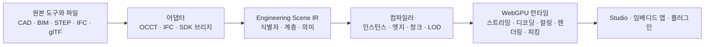

<p align="center">
  <a href="https://1n01raymond.github.io/naru/">
    
  </a>
</p>

<p align="center">
  <a href="README.md">English</a> ·
  <strong>한국어</strong> ·
  <a href="README.ja.md">日本語</a> ·
  <a href="README.zh-CN.md">简体中文</a>
</p>

<p align="center">
  <a href="https://1n01raymond.github.io/naru/"></a>
  <a href="https://github.com/1n01raymond/naru/actions/workflows/ci.yml"></a>
  <a href="LICENSE"></a>
  
  
  <a href="CONTRIBUTING.md"></a>
</p>

<p align="center">
  <strong>기존 도구를 대체하지 않고, 엔지니어링 모델을 웹으로.</strong>
  <br />
  대형 CAD·BIM·엔지니어링 장면을 위한 오픈소스 스튜디오, 컴파일러, WebGPU 런타임입니다.
</p>

<p align="center">
  <a href="https://1n01raymond.github.io/naru/"><strong>▶&nbsp;라이브 Studio 데모 열기</strong></a>
  — 실제 4개 분야 IFC 연합 모델을 순수 HTTP Range로 스트리밍합니다. 설치할 것이 없습니다.
  <br />
  <sub>실대형 스케일 측정치: 839.9 MB <code>sixty5</code> 연합 모델이 렌더링 가능한 78,173개
  occurrence 전체의 첫 coarse 프레임에 4.3초 만에 도달합니다. target detail은 별도의 고정
  64 MiB decoded·GPU 예산에 따라 admission되며 전체 프로세스 메모리는 포함되지 않습니다
  (<a href="artifacts/ifc/sixty5-first-frame/README.md">증거</a>).</sub>
</p>

> [!IMPORTANT]
> NARU는 증거 기반 Phase 1 수직 슬라이스를 완료했습니다. 이 저장소에는
> 동작하는 공개 Studio, 컴파일러, WebGPU 런타임과 재현 가능한 증거가 있지만,
> 아직 프로덕션 뷰어가 아닌 알파 품질 소프트웨어입니다.

> 이 문서는 영문 [`README.md`](README.md)의 번역본입니다. 내용이 다를 경우
> 영문 문서를 기준으로 하며, 용어와 문장에 대한 번역 검토를 환영합니다.

## 지금 브라우저에서 실제로 동작하는 것

아래 내용은 목업이나 로드맵 항목이 아닙니다. 모든 수치는 CI가 재검증하는
커밋된 증거 기록으로 연결되며, 스크린샷은 그 기록이 다이제스트로 고정한
캡처 그대로입니다.

<table>
  <tr>
    <td width="50%" valign="top">
      <a href="artifacts/browser-matrix/README.md">
        
      </a>
      <br />
      <sub><strong>실제 STEP 어셈블리, 끝까지.</strong> Adafruit PyGamer
      보드: 34개 mesh를 공유하는 85개 part occurrence, 162,838개 고유
      triangle, 13,897개 명시적 CAD edge segment, 원본 참조가 유지되는
      조이스틱 picking — Chrome과 Firefox에서 동일하게 동작합니다.
      <a href="artifacts/browser-matrix/README.md">브라우저 증거</a></sub>
    </td>
    <td width="50%" valign="top">
      <a href="artifacts/ifc/sixty5-first-frame/README.md">
        
      </a>
      <br />
      <sub><strong>실물 대형 IFC federation.</strong> 839.9 MB 7개 분야
      <code>sixty5</code> 모델: 2.4초 만에 계층과 검색 준비, 렌더링 가능한
      78,173개 occurrence 전체의 첫 coarse frame이 4.3초입니다. 점진적 target
      detail은 별도의 고정 64 MiB decoded·GPU admission 예산 안에 머물며 전체
      프로세스 메모리는 포함되지 않습니다. 선택된 기초 보는 자신의 IFC 속성을
      resolve합니다.
      <a href="artifacts/ifc/sixty5-browser/README.md">residency 증거</a> ·
      <a href="artifacts/ifc/sixty5-first-frame/README.md">첫 프레임 증거</a></sub>
    </td>
  </tr>
</table>

<sub>PyGamer CAD의 저작권은 Adafruit Industries에 있으며, 고정된 upstream
commit과 고지를 보존해 수정 없이 MIT로 재배포합니다. Adafruit가 NARU를
보증한다는 의미는 아닙니다.</sub>

## 이 증거가 당신의 모델에 의미하는 것

| 얻는 것 | 측정된 근거 |
|---|---|
| 반복 부품은 중복 없이 한 번만 저장·업로드됩니다 | 85개 occurrence가 34개 mesh를 공유 ([브라우저 matrix](artifacts/browser-matrix/README.md)) |
| CAD 경계는 삼각형에서 추측하지 않고 원본 edge에서 그립니다 | 13,897개 명시적 edge segment가 브라우저까지 유지 ([브라우저 matrix](artifacts/browser-matrix/README.md)) |
| 트리·검색·속성은 geometry가 도착하기 전에 동작합니다 | 839.9 MB federation에서 188,319개 레코드 계층이 3.3초 만에 준비 ([sixty5 브라우저 기록](artifacts/ifc/sixty5-browser/README.md)) |
| 상세 형상은 일반 HTTP 위에서 점진적으로 스트리밍됩니다 | 28건의 `scene.bin` 요청이 전부 HTTP 206 `bytes=` Range 응답 ([sixty5 브라우저 기록](artifacts/ifc/sixty5-browser/README.md)) |
| 점진적 target geometry residency는 선언된 예산 안에 머뭅니다 | promotion이 234개 중 26번째 chunk에서 정지하고 target decoded·GPU 바이트가 모두 64 MiB 미만을 유지합니다. 계층, sidecar, Worker 상태와 전체 프로세스 메모리는 이 수치에 포함되지 않습니다 ([sixty5 브라우저 기록](artifacts/ifc/sixty5-browser/README.md)) |
| 선택은 원본 CAD/BIM 식별자로 이어집니다 | 선택된 기초 보가 6개 IFC 속성 항목을 지연 resolve ([sixty5 브라우저 기록](artifacts/ifc/sixty5-browser/README.md)) |
| 실물 대형 첫 프레임이 분이 아니라 초 단위로 도착합니다 | 공유 coarse Worker 경로, 가상화된 어셈블리 목록, 거부된 청크를 건너뛰는 residency admission이 sixty5 첫 coarse frame을 268.0초에서 중앙값 4.3초로 단축 — 62.6배 개선 ([첫 프레임 기록](artifacts/ifc/sixty5-first-frame/README.md)) |
| 예산이 담을 수 없는 지오메트리는 아예 내려받지 않습니다 | 요구된 sixty5 청크는 컴파일된 문서에서 미리 계산되어 바이트 전송 전에 거부되며, 234개 중 123개가 그렇게 되어 resident set이 Range 응답 245회 대신 113회로 완성 ([첫 프레임 기록](artifacts/ifc/sixty5-first-frame/README.md)) |
| 같은 예산으로 모델을 더 많이 담습니다 | 프로토타입의 vertex pool을 material 그룹끼리 공유해 sixty5 청크 집합을 decoded 기준 230.7 MB에서 129.2 MB로, 최대 청크를 75.4 MB에서 1.3 MB로 줄여, 동일한 64 MiB 예산에서 resident 종단점을 234개 중 93개에서 111개로, 삼각형을 185만개에서 226만개로 확대 ([첫 프레임 기록](artifacts/ifc/sixty5-first-frame/README.md)) |
| 카메라 이동은 오래된 다운로드를 기다리지 않고 취소합니다 | 불필요해진 fastener Range 요청이 중단되고 새로 보이는 mounting-plate Range가 먼저 발행 — Chrome과 Firefox 모두 동일 ([브라우저 matrix](artifacts/browser-matrix/README.md)) |
| 원점에서 10,000 km 떨어진 좌표도 정밀도를 유지합니다 | 0.25 mm 판 간격이 ≤ 0.001 mm 오차로 컴파일되고 두 엔진 모두 픽셀 드리프트 0으로 렌더링 ([정밀도 기록](artifacts/precision/large-coordinates/README.md)) |
| 가까운 geometry가 함께 전송되도록 패키지를 패킹할 수 있습니다 (opt-in) | leaf-anchor payload 정렬이 Digital Hub census에서 off-view 바이트 합계를 39.9% 절감 ([spatial demand 기록](artifacts/spatial-demand/README.md)) |
| 컴파일은 바이트 단위로 재현 가능합니다 | 두 번의 전체 sixty5 컴파일이 바이트 동일 패키지 생성 ([컴파일 증거](artifacts/ifc/sixty5/README.md)) |
| **아직 아닌 것:** 실물 대형 규모의 인터랙티브급 준비 완료와 브라우저 간 성능 주장 | 4.3초 첫 프레임은 discrete GPU 호스트 1대의 단일 Chrome 기록이며, 8.9초 ready 상태는 청크 234개 중 111개에서 안정되므로 64 MiB 예산 아래에서 연합 모델 대부분은 coarse 상태로 남습니다 ([첫 프레임 기록](artifacts/ifc/sixty5-first-frame/README.md)) |

## 어디서 시작할까요

| 하고 싶은 것 | 시작점 |
|---|---|
| 모델이 동작하는 것을 보기 | Digital Hub가 로드된 [공개 Studio 데모](https://1n01raymond.github.io/naru/)를 열거나, `pnpm install && pnpm dev`로 PyGamer 어셈블리를 로컬에서 실행합니다 ([Studio 안내](apps/webgpu-spike/README.md)) |
| 뷰어를 내 앱에 임베드하기 | [Runtime 패키지](packages/runtime-webgpu/README.md) — 컴파일된 glTF 로더와 직접 WebGPU 렌더러 |
| 내 STEP·IFC 컴파일하기 | [Compiler 패키지](packages/compiler/README.md)와 아래 [컴파일러 증거](#현재-컴파일러-증거) |
| 아키텍처 이해하기 | 읽기 순서대로 정리된 [설계 문서](docs/README.md) |
| 기여하거나 결정에 이의 제기하기 | [CONTRIBUTING.md](CONTRIBUTING.md)와 [ADR 색인](docs/adr/README.md) |

## 엔지니어링 모델에도 열린 웹 플랫폼이 필요합니다

엔지니어링 팀은 이미 SolidWorks, CATIA, NX, Creo, Fusion, Onshape, Revit을
비롯한 여러 전문 시스템에서 원본 데이터를 만듭니다. 어려운 문제는 또
하나의 CAD 파일 포맷을 발명하는 것이 아닙니다. 어셈블리 식별자와
엔지니어링 의미를 잃지 않으면서 이 데이터를 브라우저에서 빠르게 열고,
검사하고, 자동화하고, 다른 제품에 임베드하는 것입니다.

NARU는 원본 도구와 웹 애플리케이션 사이의 열린 계층을 제공합니다. 장기적
비전은 Blender와 닮아 있습니다. 강력한 코어와 폭넓은 확장 생태계를 갖춘,
커뮤니티가 함께 만드는 엔지니어링 워크스페이스입니다. 다만 첫 목표는 더
명확합니다. 대형 엔지니어링 장면을 웹에서 탁월하게 전달하고 다루는 것입니다.

<table>
  <tr>
    <td width="33%" valign="top">
      <h3>원본을 그대로 기준으로</h3>
      네이티브 CAD/BIM과 중립 교환 파일은 현재도 source of truth입니다. Phase 2에
      계획된 워크스페이스는 원본 참조, 뷰, 주석, 플러그인 상태를 저장하되 대체
      CAD 포맷이 되지 않습니다.
    </td>
    <td width="33%" valign="top">
      <h3>대형 장면에 맞게 컴파일</h3>
      현재 컴파일러는 occurrence와 원본 참조를 보존하고 prototype을 재사용하며
      coarse/target partition을 생성합니다. 양자화, 압축, shape-preserving LOD는
      아직 계획 단계입니다.
    </td>
    <td width="33%" valign="top">
      <h3>WebGPU 네이티브 실행</h3>
      Worker, GPU 가시 상태, 직접 WebGPU 렌더링과 고정 target-geometry admission
      예산으로 프레임 hot path가 거대한 JavaScript scene graph에 의존하지 않게
      합니다. 전체 메모리 계측은 아직 계획 단계입니다.
    </td>
  </tr>
</table>

## 하나의 열린 파이프라인



Engineering Scene IR은 새로운 교환 포맷이 아니라 논리적인 시스템 경계입니다.
전송에는 적합한 기존 표준을 우선 사용하고, 공개 벤치마크에서 분명한 차이가
입증될 때만 최적화된 컴파일 캐시를 도입합니다.

## 만들고 있는 것

| 계층 | 역할 | 현재 구현 / 계획 |
|---|---|---|
| **NARU Studio** | 레퍼런스 엔지니어링 애플리케이션 | **구현:** 어셈블리 트리, 검색, 속성, 선택, 숨김/격리, 단면 평면 1개. **계획:** 영속 워크스페이스, 측정, 주석 |
| **NARU Runtime** | Headless 브라우저·GPU 엔진 | **구현:** 점진적 스트리밍, Worker 디코딩, 인스턴싱, 컬링, 피킹, target-geometry admission 예산. **계획:** 영속 캐시 계층, LOD, 전체 메모리 계측 |
| **NARU Compiler** | 재현 가능한 source-to-Web 빌드 파이프라인 | **구현:** STEP/IFC 어댑터, 계층·식별자·엣지, 결정적 coarse/target 청크와 캐시. **계획:** incremental compiled payload 재사용, LOD, 압축 |
| **NARU SDK** | 향후 안정화할 임베딩·확장 인터페이스 | **미출시:** 프레임워크 중립 안정 API, 명령, 패널, 분석 Worker와 권한 기반 플러그인은 계획 단계 |

### 엔지니어링 작업을 위한 설계

- 어셈블리, prototype, occurrence, 원본 객체, 이름, 색상, 단위, 변환 관계 보존
- 삼각형에서 모든 경계를 추측하는 대신 명시적인 CAD 엣지 렌더링
- 전체 정밀도 형상이 도착하기 전에 사용할 수 있는 coarse scene 표시
- 안정적인 객체 식별자를 기준으로 현재 선택, 숨김/격리, 단면을 처리하며 측정과
  주석은 계획 단계
- 점진적 target geometry residency는 선언된 decoded·GPU 예산 안에 유지하고,
  전체 프로세스 메모리는 별도로 계측
- 현재 애플리케이션과 패키지 경계가 안정된 뒤 지원되는 self-host 및
  프레임워크 중립 임베딩 경로 제공 예정

## 프로젝트 상태

로드맵은 날짜가 아니라 검증 가능한 결과를 기준으로 진행됩니다.

| 단계 | 결과 | 상태 |
|---|---|---|
| **0 — 타당성 검증** | OCCT 식별자·엣지를 직접 WebGPU 프로토타입까지 연결 | **완료** |
| **1 — 수직 슬라이스** | 핵심 엔지니어링 인터랙션을 갖춘 공개 STEP-to-browser 데모 | **완료** |
| **2 — 대형 장면 알파** | 10만+ occurrence, 스트리밍, LOD, 캐시, 메모리 예산 | **현재** |
| **3 — 오픈 플랫폼 베타** | 플러그인, IFC, 임베딩 예제, 셀프 호스팅 배포 | 예정 |

전체 [로드맵](docs/ROADMAP.md), 현재 [Phase 2 트래커](docs/PHASE_2.md),
[Phase 1 증거](docs/PHASE_1.md), [Phase 1 완료 보고서](docs/PHASE_1_REPORT.md),
[Phase 0 기록](docs/PHASE_0.md),
[Chrome/Firefox WebGPU matrix](artifacts/browser-matrix/README.md)를
확인하세요. 공개된 성능 수치에는 재배포 가능한 모델, 정확한 하드웨어·브라우저
정보, cold/warm 상태와 재현 명령이 함께 제공됩니다.

실제 레퍼런스 소스는 이제 대용량 바이너리를 커밋하지 않고 체크섬으로
고정됩니다: NIST AP242 적합성 케이스 2건, IFC-Bench의 4개 분야 Digital Hub
federation, 839.9 MB 7개 분야 `sixty5` federation이 파일별 고정 다이제스트로
검증됩니다. `sixty5` 다운로드는 명시적 opt-in으로 유지됩니다.
[외부 fixture 레지스트리](fixtures/external/README.md)를 확인하세요.

## 현재 컴파일러 증거

저장소에는 이제 미리 추출된 Scene IR뿐 아니라 실행 가능한 로컬 AP242/AP214
경로가 있습니다. 고정된 OCCT Python 어댑터 의존성을 설치하면 하나의 명령으로
STEP을 읽고, 어셈블리 재사용과 CAD 엣지를 보존하고, 원본 식별자를 검증한 뒤
컴파일된 glTF 파일 쌍을 생성합니다.

```sh
python -m pip install -r native/adapter-occt/tools/requirements-evidence.txt
pnpm naru compile fixtures/step/repeated-fasteners-ap242.step \
  --output output/repeated-fasteners-ap242
```

커밋된 AP242 결과는 Khronos glTF 오류·경고 0건으로 독립 검증됩니다. 확장된
Scene IR은 임시 데이터이며 NARU 파일 포맷이 아닙니다. [컴파일러 증거](artifacts/phase1/README.md)를
확인하세요.

같은 컴파일러 경계에는 이제 초기 다중 문서 IFC 경로가 있습니다. 검증된
Digital Hub 슬라이스는 고정된 IfcOpenShell 0.8.5로 건축·난방·배관·환기를
federation합니다: 렌더링 가능한 5,152개 occurrence, 3,383개 공유 geometric
prototype, 913,520개 고유 triangle, 273,188개 속성 값. 소스와 패키지 해시는
Khronos glTF 오류·경고 0건으로 독립 검증됩니다. 이는 정확성 증거이며 아직
대형 장면 성능 주장이 아닙니다.
[IFC federation 증거](artifacts/ifc/digital-hub/README.md)를 확인하세요.

두 컴파일러 모두 `--cache <dir>`로 변경되지 않은 소스를 추출 재실행 없이
검증된 영속 캐시에서 복원합니다. 엔트리는 소스·어댑터·컴파일러·옵션
identity로 키가 만들어지고, 손상된 엔트리는 전체 재컴파일로 폴백합니다.
고정된 PyGamer STEP 픽스처와 Digital Hub federation에서 기록된 증거는
19.9초·46.3초 콜드 컴파일 대비 1.7초·0.5초의 바이트 동일 웜 복원을 보여줍니다
([캐시 증거](artifacts/cache/README.md),
[ADR-0009](docs/adr/0009-persistent-compiled-cache.md),
[import·캐시 설계](docs/IMPORT_AND_CACHE.md)).

## 설계 문서부터 시작하기

| 알고 싶은 내용 | 문서 |
|---|---|
| 제품의 첫 목표와 주요 워크플로 | [제품 기획](docs/PRODUCT.md) |
| 시스템 경계와 데이터 흐름 | [전체 아키텍처](docs/ARCHITECTURE.md) |
| 중립 장면 데이터 모델 | [Engineering Scene IR](docs/SCENE_IR.md) |
| STEP/OCCT 입력과 컴파일 | [컴파일러 설계](docs/COMPILER.md) |
| 브라우저 스케줄링과 WebGPU 렌더링 | [런타임 설계](docs/RUNTIME.md) |
| 확장 또는 임베디드 제품 설계 | [플러그인 아키텍처](docs/PLUGINS.md) |
| 핵심 기술 선택 검토 | [Architecture Decision Records](docs/adr/README.md) |

모든 설계 문서는 [`docs/README.md`](docs/README.md)에 정리되어 있습니다.

## 원칙

1. **원본 도구가 기준입니다.** 포맷 이전을 강요하지 않고 기존 엔지니어링
   시스템을 보완합니다.
2. **의미와 렌더링 형상을 분리합니다.** 최고 정밀도 형상이 메모리에 없어도
   객체를 찾고 조회할 수 있습니다.
3. **단순 변환이 아니라 컴파일합니다.** 브라우저 시작 시간, 메모리, 대역폭,
   드로우 오버헤드를 줄이는 작업을 오프라인에서 수행합니다.
4. **첫 바이트부터 점진적으로 표시합니다.** 첫 유용한 인터랙션까지의 시간을
   핵심 지표로 봅니다.
5. **Hot path는 data-oriented입니다.** 프레임별 작업에 패킹 배열, 배치,
   GPU 가시 상태를 사용합니다.
6. **표준을 우선하고 근거로 결정합니다.** 커스텀 전송 구조에는 측정된 이유와
   호환성 전략이 필요합니다.
7. **런타임은 커널에 종속되지 않습니다.** OCCT와 상용 변환 SDK는 어댑터 뒤에
   머물며 브라우저 공개 API로 노출되지 않습니다.
8. **열려 있고 임베드할 수 있어야 합니다.** 코어 구성요소는 Studio UI 없이도
   사용할 수 있습니다.

## 자주 묻는 질문

<details>
<summary><strong>NARU는 새로운 CAD 파일 포맷인가요?</strong></summary>
<br />
아닙니다. 기존 CAD/BIM 문서가 source of truth로 남습니다. NARU는 중립적인
인메모리 경계를 정의하고 브라우저 전송에 최적화된, 폐기·재생성 가능한 버전드
캐시를 만들 수 있습니다.
</details>

<details>
<summary><strong>Fusion, Onshape 또는 데스크톱 CAD를 대체하려는 건가요?</strong></summary>
<br />
초기 범위에서는 아닙니다. 첫 제품은 대형 장면 엔지니어링 워크스페이스이자
임베드 가능한 런타임입니다. 향후 독립적인 워크벤치로 정밀 파라메트릭 저작
기능을 추가할 수 있지만, 코어 플랫폼의 가치에 필수적인 조건은 아닙니다.
</details>

<details>
<summary><strong>왜 OCCT와 직접 WebGPU 런타임을 결합하나요?</strong></summary>
<br />
Open CASCADE는 정밀 형상, 어셈블리, 원본 엣지를 읽는 성숙한 오프라인 경로를
제공합니다. 브라우저 런타임의 역할은 컴파일된 장면 데이터를 효율적으로
스트리밍하고 다루는 것입니다. 두 경계를 분리하면 렌더링 hot path에 형상
커널을 넣지 않아도 됩니다.
</details>

<details>
<summary><strong>왜 전체 뷰어를 Three.js로 만들지 않나요?</strong></summary>
<br />
Three.js는 여전히 생태계의 여러 도구와 실험에 유용합니다. NARU의 대형 장면
렌더러는 배칭, residency, 피킹, 메모리 정책을 명시적으로 제어하기 위해 직접
WebGPU 데이터 구조를 사용합니다. 이는 집중할 아키텍처를 고른 것이지,
범용 scene graph가 잘못되었다는 뜻이 아닙니다.
</details>

<details>
<summary><strong>glTF는 어디에 사용하나요?</strong></summary>
<br />
glTF는 중요한 표준 기반 전송·상호운용 선택지입니다. 엔지니어링 식별자, 엣지,
스트리밍, 정밀도 요구를 충족하는 범위에서 glTF, meshopt, KTX2, 3D Tiles의
개념과 메타데이터 표준을 재사용합니다. 첫 Phase 1 컴파일러 슬라이스는 glTF
2.0과 외부 binary 리소스를 생성합니다. 브라우저는 이제 계층을 먼저 열고
Worker에서 geometry를 해석하며, NARU 식별자와 원본 매핑은 명시적으로 실험
상태인 `extras`에 보관합니다.
</details>

## 기여하기

NARU는 아직 근거에 따라 아키텍처를 바꿀 수 있는 초기 단계입니다. 지금 특히
도움이 되는 기여는 다음과 같습니다.

- 엣지 케이스가 문서화된 재배포 가능 STEP·IFC 테스트 모델
- OCCT 추출 및 WebGPU 렌더링 기술 검증
- 벤치마크 하네스와 투명한 기준 결과
- 식별자, 정밀도, 캐시, 플러그인 결정에 대한 리뷰
- 실제 엔지니어링 팀의 제품 워크플로
- 문서 및 번역 검토

[CONTRIBUTING.md](CONTRIBUTING.md)를 읽고,
[열린 이슈](https://github.com/1n01raymond/naru/issues)를 살펴보거나
[번역](docs/TRANSLATIONS.md)을 개선해 주세요. 큰 변경은 구현 전에 가정과
방향을 공유할 수 있도록 설계 이슈에서 시작하는 것을 권장합니다.

## 저장소 구성

```text
apps/
  webgpu-spike/       Phase 1 glTF + Worker + WebGPU 브라우저 검증
  benchmark-lab/      NARU 대 Three.js 산업용 벤치마크 하네스
packages/
  compiler/           결정적 Scene IR → 표준 우선 glTF 컴파일러
  scene-ir/           인메모리 엔지니어링 장면 타입과 검증기
  runtime-webgpu/     glTF 로더와 직접 WebGPU 렌더링 경로
native/
  adapter-occt/       격리된 STEP/XDE 추출 스파이크
  adapter-ifc/        격리된 다중 문서 IFC federation 어댑터
fixtures/
  step/               재배포 가능한 STEP manifest와 검토 정책
  ifc/                재배포 가능한 IFC 엣지 케이스 fixture
  external/           다운로드 방식 STEP/IFC 레지스트리와 라이선스 기록
tools/
  benchmark/          재현 가능한 벤치마크 결과 하네스
  external-fixtures/  체크섬 고정 외부 소스를 manifest 기준으로 검증
scripts/              `pnpm check`가 실행하는 증거 recorder·validator
artifacts/            CI가 재검증하는 커밋된 증거 기록
docs/
  PRODUCT.md          제품 요구사항과 주요 워크플로
  ARCHITECTURE.md     시스템 경계와 품질 속성
  SCENE_IR.md         의미·어셈블리·표현 모델
  COMPILER.md         입력 및 컴파일 파이프라인
  IMPORT_AND_CACHE.md 임포트 파이프라인과 영속 컴파일 캐시
  RUNTIME.md          브라우저·WebGPU 런타임 설계
  PLUGINS.md          확장 및 자동화 모델
  BENCHMARKS.md       재현 가능한 성능 계약
  ROADMAP.md          결과 기반 개발 단계
  TRANSLATIONS.md     README 번역 정책과 현황
  adr/                Architecture Decision Records
  media/              프로젝트 로고와 시각 자산
```

## 라이선스

NARU는 [Apache License 2.0](LICENSE)으로 제공됩니다. 계획된 서드파티
의존성은 다른 호환 라이선스를 사용할 수 있습니다. 자세한 내용은
[THIRD_PARTY.md](THIRD_PARTY.md)를 확인하세요.

<p align="center">
  <sub>대규모 CAD·BIM을 위한 WebGPU 네이티브 엔진.</sub>
</p>
