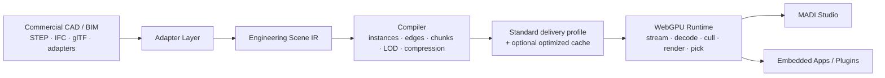

# MADI

**The open engineering studio for the Web.**

MADI is an open-source, extensible workspace and WebGPU runtime for massive CAD,
BIM, and engineering scenes. It is designed to ingest data produced by existing
engineering tools, compile it into a progressively streamable scene, and make
that scene available to browser applications without routing the rendering hot
path through a general-purpose JavaScript scene graph.

MADI is at the architecture and prototyping stage. The repository currently
contains the product plan, technical architecture, decision records, benchmark
plan, and contribution model that will guide the first implementation.

## Why MADI?

Engineering teams already create authoritative data in tools such as
SolidWorks, CATIA, NX, Creo, Fusion, Onshape, Revit, and many domain-specific
systems. MADI does not ask those teams to replace their source tools or adopt a
new CAD exchange format. Instead, it provides an open layer for:

- opening and navigating very large assemblies in the browser;
- combining CAD, BIM, and related engineering data in one workspace;
- inspecting, measuring, sectioning, annotating, and comparing models;
- embedding a self-hostable engineering viewport into other products;
- automating workflows through a stable TypeScript and plugin API; and
- experimenting with WebGPU-native rendering and scene processing in public.

## Product shape



## What MADI is—and is not

MADI begins as an engineering scene platform, not as a full replacement for a
production parametric CAD system. Existing CAD/BIM documents remain the source
of truth. MADI project files store workspace state, references, annotations,
views, and plugin data. Render payloads are derived caches that can be rebuilt.

The architecture leaves room for future exact-geometry and authoring
workbenches, but the first product wedge is deliberately narrower: make massive
engineering scenes open, fast, scriptable, and embeddable on the Web.

## Initial capabilities

The first end-to-end release targets:

- STEP AP242 ingestion through an Open CASCADE adapter;
- assembly, prototype, occurrence, and source-reference preservation;
- explicit CAD edge extraction;
- progressive coarse-to-exact loading;
- worker-based decoding and bounded CPU/GPU memory;
- a direct WebGPU renderer with object picking and section planes;
- assembly tree, search, hide, isolate, selection, and measurement;
- a headless runtime API and a small reference Studio application; and
- reproducible comparisons against standards-based and existing Web viewers.

## Repository map

```text
docs/
  PRODUCT.md                 Product requirements and user workflows
  ARCHITECTURE.md            System architecture and quality attributes
  SCENE_IR.md                Logical engineering scene data model
  COMPILER.md                Ingestion and compilation pipeline
  RUNTIME.md                 Browser and WebGPU runtime design
  PLUGINS.md                 Extension and automation model
  BENCHMARKS.md              Reproducible performance plan
  ROADMAP.md                 Delivery phases and exit criteria
  adr/                       Architecture decision records
CONTRIBUTING.md              How to contribute
GOVERNANCE.md                Project governance
SECURITY.md                  Security policy and trust boundaries
THIRD_PARTY.md               Planned third-party dependencies and obligations
```

## Architecture principles

1. **Source tools remain authoritative.** Native CAD/BIM and neutral exchange
   files are inputs, not formats MADI attempts to replace.
2. **Semantics and render geometry are separate.** An object can exist and be
   queried before its highest-detail geometry is resident.
3. **Compiled, not merely converted.** The offline pipeline is free to
   instance, partition, quantize, reorder, and compress data for the Web.
4. **Progressive from the first byte.** Time to first useful interaction is a
   first-class metric.
5. **Data-oriented GPU hot path.** Per-frame work uses packed arrays, batches,
   and GPU-visible state rather than large JavaScript object graphs.
6. **Standards first.** glTF, 3D Tiles concepts, meshopt, KTX2, and established
   metadata standards are reused where they fit. A custom cache is justified
   only by measured requirements.
7. **Kernel-agnostic runtime.** Open CASCADE and proprietary translation SDKs
   stay behind adapters and never leak into the browser API.
8. **Open and embeddable.** Core components are usable without the Studio UI.

## Status

`0.0.0-planning` — no production implementation exists yet.

Start with [the product plan](docs/PRODUCT.md), then read
[the architecture](docs/ARCHITECTURE.md) and the
[architecture decisions](docs/adr/README.md).

## License

Apache License 2.0. Planned third-party dependencies may use other compatible
licenses; see [THIRD_PARTY.md](THIRD_PARTY.md).
