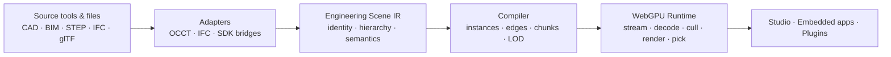

<p align="center">
  
</p>

<p align="center">
  <strong>English</strong> ·
  <a href="README.ko.md">한국어</a> ·
  <a href="README.ja.md">日本語</a> ·
  <a href="README.zh-CN.md">简体中文</a>
</p>

<p align="center">
  <a href="LICENSE"></a>
  
  
  <a href="CONTRIBUTING.md"></a>
</p>

<p align="center">
  <strong>Bring engineering models to the Web—without replacing the tools that created them.</strong>
  <br />
  An open-source studio, compiler, and WebGPU runtime for massive CAD, BIM, and engineering scenes.
</p>

> [!IMPORTANT]
> MADI is currently at the architecture and prototyping stage. This repository
> defines the product, system boundaries, benchmarks, and implementation path;
> it does not yet contain an installable production viewer.

## Engineering models deserve an open Web platform

Engineering teams already create authoritative data in SolidWorks, CATIA, NX,
Creo, Fusion, Onshape, Revit, and many specialized systems. The hard problem is
not inventing another CAD file format. It is making that data fast, inspectable,
scriptable, and embeddable in a browser—without losing assembly identity or
engineering meaning.

MADI provides the open layer between source tools and Web applications. Its
long-term ambition is Blender-like in spirit: a community-built engineering
workspace with a capable core and a broad extension ecosystem. Its immediate
focus is deliberately narrower—excellent large-scene delivery and interaction.

<table>
  <tr>
    <td width="33%" valign="top">
      <h3>Keep the source of truth</h3>
      Native CAD/BIM and neutral exchange files remain authoritative. MADI
      workspaces store references, views, annotations, and plugin state—not a
      replacement CAD format.
    </td>
    <td width="33%" valign="top">
      <h3>Compile for scale</h3>
      The offline pipeline preserves occurrences and source references while
      instancing, partitioning, quantizing, compressing, and building
      progressive levels of detail.
    </td>
    <td width="33%" valign="top">
      <h3>Run WebGPU-native</h3>
      Packed data, bounded memory, Workers, GPU-visible state, and direct
      WebGPU rendering keep the frame hot path independent of a large
      JavaScript scene graph.
    </td>
  </tr>
</table>

## One open pipeline



The Engineering Scene IR is a logical boundary, not a new interchange format.
Delivery uses established standards where they fit; an optimized compiled cache
is introduced only when public benchmarks demonstrate a material gap.

## What we are building

| Layer | Responsibility | First vertical slice |
|---|---|---|
| **MADI Studio** | Reference engineering workspace | Assembly tree, search, properties, selection, hide/isolate, section, measurement |
| **MADI Runtime** | Headless browser and GPU engine | Progressive streaming, Worker decode, instancing, culling, picking, bounded GPU memory |
| **MADI Compiler** | Reproducible source-to-Web build pipeline | STEP AP242 through OCCT, hierarchy and edge preservation, LOD and chunk generation |
| **MADI SDK** | Stable embedding and extension surface | Framework-neutral TypeScript API, commands, panels, analysis Workers, capability-scoped plugins |

### Designed for engineering work

- Preserve assembly, prototype, occurrence, source object, name, color, unit,
  and transform relationships.
- Draw explicit CAD edges instead of guessing every meaningful boundary from
  tessellated triangles.
- Show a useful coarse scene before all target-detail geometry arrives.
- Select, hide, isolate, clip, measure, and annotate by stable object identity.
- Keep CPU and GPU memory inside declared budgets, even on very large scenes.
- Self-host the Studio or embed the runtime inside another product.

## Project status

The roadmap is evidence-gated rather than date-driven.

| Phase | Outcome | Status |
|---|---|---|
| **0 — Feasibility** | Connect OCCT identity and edges to a direct WebGPU prototype | **Complete** |
| **1 — Vertical slice** | Public STEP-to-browser demo with core engineering interaction | **Current** |
| **2 — Large-scene alpha** | 100k+ occurrences, streaming, LOD, cache, and memory budgets | Planned |
| **3 — Open platform beta** | Plugins, IFC, embedding examples, and self-host deployment | Planned |

See the full [roadmap](docs/ROADMAP.md), [Phase 1 evidence](docs/PHASE_1.md),
[Phase 0 record](docs/PHASE_0.md), and
[Chrome/Firefox WebGPU matrix](artifacts/browser-matrix/README.md). Performance
claims will be published with redistributable models, exact hardware and browser
details, cold/warm states, and reproducible commands.

## Current runtime proof


The canonical demo now uses Adafruit's real PyGamer electronics assembly rather
than a synthetic mascot: 34 shared meshes, 85 part occurrences, 162,838 unique
triangles, 13,897 explicit CAD edge segments, Worker decoding, and source-aware
joystick picking in Chrome and Firefox. The unmodified CAD is redistributed
under MIT with a pinned upstream commit and notice; Adafruit does not endorse
MADI. See the [reviewed browser evidence](artifacts/browser-matrix/README.md).

## Start with the design

| If you want to… | Read… |
|---|---|
| Understand the product wedge and target workflows | [Product plan](docs/PRODUCT.md) |
| Review system boundaries and data flow | [System architecture](docs/ARCHITECTURE.md) |
| Inspect the neutral scene model | [Engineering Scene IR](docs/SCENE_IR.md) |
| Explore STEP/OCCT ingestion and compilation | [Compiler design](docs/COMPILER.md) |
| Explore browser scheduling and WebGPU rendering | [Runtime design](docs/RUNTIME.md) |
| Design an extension or embedded product | [Plugin architecture](docs/PLUGINS.md) |
| Challenge a foundational choice | [Architecture decisions](docs/adr/README.md) |

All design documents are indexed in [`docs/README.md`](docs/README.md).

## Principles

1. **Source tools remain authoritative.** MADI complements existing engineering
   systems instead of forcing a format migration.
2. **Semantics and render geometry are separate.** Objects can be discovered
   and queried before their highest-detail geometry is resident.
3. **Compiled, not merely converted.** Offline work is used to reduce browser
   startup, memory, bandwidth, and draw overhead.
4. **Progressive from the first byte.** Time to first useful interaction is a
   first-class metric.
5. **Data-oriented in the hot path.** Packed arrays, batches, and GPU-visible
   state are preferred for per-frame work.
6. **Standards first, evidence always.** Custom delivery structures require a
   measured reason and a documented compatibility story.
7. **Kernel-agnostic runtime.** OCCT and proprietary translation SDKs stay
   behind adapters and never leak into the public browser API.
8. **Open and embeddable.** Core components remain useful without the Studio UI.

## Frequently asked questions

<details>
<summary><strong>Is MADI a new CAD file format?</strong></summary>
<br />
No. Existing CAD/BIM documents remain the source of truth. MADI defines a
neutral in-memory boundary and may generate disposable, versioned delivery
caches optimized for the browser.
</details>

<details>
<summary><strong>Is MADI trying to replace Fusion, Onshape, or desktop CAD?</strong></summary>
<br />
Not in its initial scope. The first product is a large-scene engineering
workspace and embeddable runtime. Exact parametric authoring may arrive later as
independent workbenches, but it is not required for the core platform to be
valuable.
</details>

<details>
<summary><strong>Why OCCT plus a direct WebGPU runtime?</strong></summary>
<br />
Open CASCADE provides a mature offline path for reading exact geometry,
assemblies, and source edges. The browser runtime has a different job: stream
and interact with compiled scene data efficiently. Keeping those boundaries
separate avoids shipping a geometry kernel in the rendering hot path.
</details>

<details>
<summary><strong>Why not build the entire viewer on Three.js?</strong></summary>
<br />
Three.js remains useful around the ecosystem and may appear in tools or
experiments. MADI's large-scene renderer uses direct WebGPU data structures so
its batching, residency, picking, and memory policies are explicit. This is an
architectural focus, not a claim that general-purpose scene graphs are wrong.
</details>

<details>
<summary><strong>Where does glTF fit?</strong></summary>
<br />
glTF is an important standards-based delivery and interoperability option. MADI
reuses glTF, meshopt, KTX2, 3D Tiles concepts, and metadata standards where they
meet engineering identity, edge, streaming, and precision requirements. The
first Phase 1 compiler slice emits glTF 2.0 plus an external binary resource;
the browser now opens its hierarchy first and decodes geometry in a Worker.
MADI identity and source mappings remain explicitly experimental `extras`.
</details>

## Contributing

MADI is early enough that evidence can still change the architecture. Useful
contributions right now include:

- redistributable STEP or IFC fixtures with documented edge cases;
- OCCT extraction and WebGPU rendering spikes;
- benchmark harnesses and transparent baseline results;
- reviews of identity, precision, caching, and plugin decisions;
- product workflows from real engineering teams; and
- documentation and translation review.

Read [CONTRIBUTING.md](CONTRIBUTING.md), browse the
[open issues](https://github.com/1n01raymond/madi/issues), or improve a
[translation](docs/TRANSLATIONS.md). Large changes should begin with a design
issue so assumptions are visible before implementation.

## Repository map

```text
apps/
  webgpu-spike/       Phase 1 compiled glTF + Worker + WebGPU browser proof
packages/
  compiler/           Deterministic Scene IR to standards-first glTF compiler
  scene-ir/           In-memory engineering scene types and validator
  runtime-webgpu/     Compiled glTF loader and direct WebGPU rendering path
native/
  adapter-occt/       Isolated STEP/XDE extraction spike
fixtures/
  step/               Redistributable STEP manifest and review policy
tools/
  benchmark/          Reproducible benchmark result harness
docs/
  PRODUCT.md          Product requirements and target workflows
  ARCHITECTURE.md     System boundaries and quality attributes
  SCENE_IR.md         Semantic, assembly, and representation model
  COMPILER.md         Ingestion and compilation pipeline
  RUNTIME.md          Browser and WebGPU runtime design
  PLUGINS.md          Extension and automation model
  BENCHMARKS.md       Reproducible performance contract
  ROADMAP.md          Evidence-gated delivery phases
  TRANSLATIONS.md     README localization policy and status
  adr/                Architecture decision records
  media/              Project mark and visual assets
```

## License

MADI is available under the [Apache License 2.0](LICENSE). Planned third-party
dependencies may use other compatible licenses; see
[THIRD_PARTY.md](THIRD_PARTY.md).

<p align="center">
  <sub>Open engineering for the Web.</sub>
</p>
