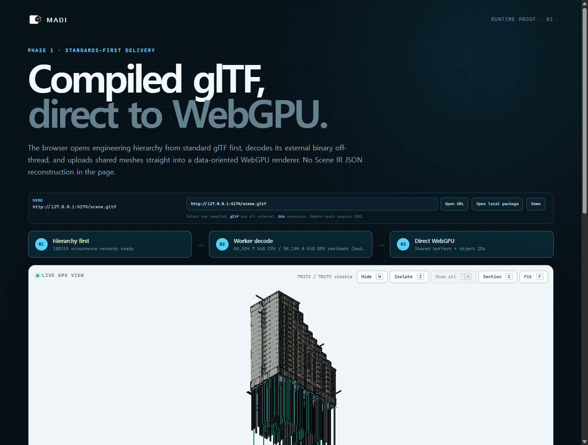

<p align="center">
  
</p>

<p align="center">
  <a href="README.md">English</a> ·
  <a href="README.ko.md">한국어</a> ·
  <a href="README.ja.md">日本語</a> ·
  <strong>简体中文</strong>
</p>

<p align="center">
  <a href="LICENSE"></a>
  
  
  <a href="CONTRIBUTING.md"></a>
</p>

<p align="center">
  <strong>无需替换现有工具，让工程模型进入 Web。</strong>
  <br />
  面向大型 CAD、BIM 与工程场景的开源工作室、编译器和 WebGPU 运行时。
</p>

> [!IMPORTANT]
> NARU 目前处于架构设计与原型验证阶段。本仓库定义产品方向、系统边界、
> 基准测试和实现路径；目前尚不包含可安装的生产级查看器。

> 本文是英文 [`README.md`](README.md) 的翻译。如内容存在差异，以英文版为准。
> 欢迎帮助审校术语和表达。

## 浏览器中已经真实运行的内容

以下内容不是效果图，也不是路线图条目：每个数字都链接到由 CI 反复校验的
已提交证据记录，截图正是这些记录以摘要固定的原始捕获。

<table>
  <tr>
    <td width="50%" valign="top">
      <a href="artifacts/browser-matrix/README.md">
        
      </a>
      <br />
      <sub><strong>一个真实的 STEP 装配体，端到端。</strong> Adafruit
      PyGamer 主板：85 个 part occurrence 共享 34 个 mesh、162,838 个唯一
      triangle、13,897 条显式 CAD edge segment，以及保留源引用的摇杆
      picking —— 在 Chrome 与 Firefox 中行为一致。
      <a href="artifacts/browser-matrix/README.md">浏览器证据</a></sub>
    </td>
    <td width="50%" valign="top">
      <a href="artifacts/ifc/sixty5-browser/README.md">
        
      </a>
      <br />
      <sub><strong>真实的超大 IFC federation。</strong> 839.9 MB 的七专业
      <code>sixty5</code> 模型：3.3 秒内层级与搜索就绪，78,173 个可渲染
      occurrence 全部呈现，geometry 始终保持在固定的 64 MiB 预算之内，
      被选中的基础梁解析出自身的 IFC 属性。
      <a href="artifacts/ifc/sixty5-browser/README.md">residency 证据</a></sub>
    </td>
  </tr>
</table>

<sub>PyGamer CAD 版权归 Adafruit Industries 所有，按 MIT 许可证原样再分发，
并固定上游 commit 与声明；这不表示 Adafruit 对 NARU 的认可。两张截图记录于
NARU 更名之前，显示的是项目的旧名称。</sub>

## 这些证据对你的模型意味着什么

| 你得到什么 | 已测量的依据 |
|---|---|
| 重复零件只存储、上传一次，而不是重复复制 | 85 个 occurrence 共享 34 个 mesh（[浏览器 matrix](artifacts/browser-matrix/README.md)） |
| CAD 边界取自源 edge 绘制，而非从三角形猜测 | 13,897 条显式 edge segment 一直保留到浏览器（[浏览器 matrix](artifacts/browser-matrix/README.md)） |
| 树、搜索与属性在 geometry 到达之前即可使用 | 839.9 MB federation 上，188,319 条记录的层级 3.3 秒就绪（[sixty5 浏览器记录](artifacts/ifc/sixty5-browser/README.md)） |
| 细节几何通过普通 HTTP 渐进流式传输 | 28 次 `scene.bin` 请求全部为 HTTP 206 `bytes=` Range 响应（[sixty5 浏览器记录](artifacts/ifc/sixty5-browser/README.md)） |
| 无论场景多大，内存都保持在声明的预算内 | promotion 在 234 个 chunk 的第 26 个处停止；解码与 GPU 字节均保持在 64 MiB 以下（[sixty5 浏览器记录](artifacts/ifc/sixty5-browser/README.md)） |
| 选择可解析回源 CAD/BIM 标识 | 被选中的基础梁按需解析出 6 条 IFC 属性条目（[sixty5 浏览器记录](artifacts/ifc/sixty5-browser/README.md)） |
| 编译结果逐字节可复现 | 两次完整的 sixty5 编译产生逐字节相同的包（[编译证据](artifacts/ifc/sixty5/README.md)） |
| **尚未做到：** 超大规模下的快速首帧 | sixty5 首个 coarse frame 耗时 268.0 秒 —— 作为下一阶段必须超越的边界被有意记录（[记录的边界](artifacts/ifc/sixty5-browser/README.md)） |

## 从哪里开始

| 你想做什么 | 入口 |
|---|---|
| 看模型实际运行 | `pnpm install && pnpm dev` 会打开已加载 PyGamer 装配体的 Studio（[Studio 指南](apps/webgpu-spike/README.md)）；托管的公开演示是 Phase 1 的目标（[路线图](docs/ROADMAP.md)） |
| 把查看器嵌入你的应用 | [Runtime 包](packages/runtime-webgpu/README.md) —— 编译 glTF 加载器与直接 WebGPU 渲染器 |
| 编译你自己的 STEP、IFC | [Compiler 包](packages/compiler/README.md)与下方的[编译器验证](#当前编译器验证) |
| 理解整体架构 | 按阅读顺序整理的[设计文档](docs/README.md) |
| 参与贡献或质疑某项决策 | [CONTRIBUTING.md](CONTRIBUTING.md)与 [ADR 索引](docs/adr/README.md) |

## 工程模型也需要一个开放的 Web 平台

工程团队已经在 SolidWorks、CATIA、NX、Creo、Fusion、Onshape、Revit
以及众多专业系统中创建权威数据。真正困难的并不是发明另一种 CAD 文件格式，
而是在不丢失装配身份和工程语义的前提下，让这些数据能够在浏览器中快速打开、
检查、自动化，并嵌入其他产品。

NARU 在源工具和 Web 应用之间提供一个开放层。它的长期愿景在精神上类似
Blender：由社区共同构建一个拥有强大核心和广泛扩展生态的工程工作空间。
近期目标则更加聚焦——把大型工程场景的交付与交互做好。

<table>
  <tr>
    <td width="33%" valign="top">
      <h3>保留权威数据源</h3>
      原生 CAD/BIM 和中性交换文件始终是 source of truth。NARU 工作空间保存
      引用、视图、批注和插件状态，而不是成为一种替代 CAD 格式。
    </td>
    <td width="33%" valign="top">
      <h3>为规模而编译</h3>
      离线管线在保留 occurrence 与源引用的同时，完成实例化、分区、量化、
      压缩和渐进式 LOD 构建。
    </td>
    <td width="33%" valign="top">
      <h3>以 WebGPU 原生运行</h3>
      通过紧凑数据、受控内存、Worker、GPU 可见状态与直接 WebGPU 渲染，
      使每帧 hot path 不依赖庞大的 JavaScript scene graph。
    </td>
  </tr>
</table>

## 一条开放的管线


Engineering Scene IR 是逻辑系统边界，而不是新的交换格式。交付层优先采用
适用的既有标准；只有公开基准测试证明存在实质差距时，才引入优化后的编译缓存。

## 我们正在构建什么

| 层 | 职责 | 首个垂直切片 |
|---|---|---|
| **NARU Studio** | 参考工程工作空间 | 装配树、搜索、属性、选择、隐藏/隔离、剖切、测量 |
| **NARU Runtime** | Headless 浏览器与 GPU 引擎 | 渐进式流送、Worker 解码、实例化、剔除、拾取、GPU 内存预算 |
| **NARU Compiler** | 可复现的 source-to-Web 构建管线 | 通过 OCCT 读取 STEP AP242，保留层级与边线，生成 LOD 与分块 |
| **NARU SDK** | 稳定的嵌入与扩展接口 | 框架无关的 TypeScript API、命令、面板、分析 Worker、能力授权插件 |

### 为工程工作而设计

- 保留装配、prototype、occurrence、源对象、名称、颜色、单位和变换关系
- 渲染显式 CAD 边线，而不是从三角形中猜测所有有意义的边界
- 在完整目标精度几何到达前，先显示可操作的粗略场景
- 基于稳定对象身份进行选择、隐藏、隔离、裁剪、测量和批注
- 即使面对超大场景，也遵守声明的 CPU 与 GPU 内存预算
- 自托管 Studio，或将运行时嵌入其他产品

## 项目状态

路线图以可验证的成果为门槛，而不是以日期驱动。

| 阶段 | 成果 | 状态 |
|---|---|---|
| **0 — 可行性验证** | 将 OCCT 身份与边线连接到直接 WebGPU 原型 | **完成** |
| **1 — 垂直切片** | 具备核心工程交互的公开 STEP-to-browser 演示 | **当前** |
| **2 — 大场景 alpha** | 10 万以上 occurrence、流送、LOD、缓存和内存预算 | 计划中 |
| **3 — 开放平台 beta** | 插件、IFC、嵌入示例与自托管部署 | 计划中 |

请查看完整[路线图](docs/ROADMAP.md)、[Phase 1 进展](docs/PHASE_1.md)与
[基准测试约定](docs/BENCHMARKS.md)。性能数据将与可再分发模型、准确的硬件和
浏览器信息、cold/warm 状态及可复现命令一同发布。

## 当前编译器验证

仓库现在不仅包含预先提取的 Scene IR，还提供可执行的本地 AP242/AP214 路径。
安装固定版本的 OCCT Python 适配器依赖后，一条命令即可读取 STEP、保留装配复用
与 CAD edge、验证源标识，并输出编译后的 glTF 文件对：

```sh
python -m pip install -r native/adapter-occt/tools/requirements-evidence.txt
pnpm naru compile fixtures/step/repeated-fasteners-ap242.step \
  --output output/repeated-fasteners-ap242
```

提交的 AP242 结果经独立验证，Khronos glTF 错误和警告均为 0。展开的 Scene IR
只是临时数据，并非 NARU 文件格式。请查看[编译器证据](artifacts/phase1/README.md)。

## 从设计文档开始

| 你想了解… | 请阅读… |
|---|---|
| 产品切入点和目标工作流 | [产品规划](docs/PRODUCT.md) |
| 系统边界与数据流 | [系统架构](docs/ARCHITECTURE.md) |
| 中立场景数据模型 | [Engineering Scene IR](docs/SCENE_IR.md) |
| STEP/OCCT 导入与编译 | [编译器设计](docs/COMPILER.md) |
| 浏览器调度与 WebGPU 渲染 | [运行时设计](docs/RUNTIME.md) |
| 扩展或嵌入式产品 | [插件架构](docs/PLUGINS.md) |
| 基础技术决策 | [Architecture Decision Records](docs/adr/README.md) |

所有设计文档均索引于 [`docs/README.md`](docs/README.md)。

## 原则

1. **源工具保持权威。** NARU 补充现有工程系统，而不是强制迁移格式。
2. **语义与渲染几何分离。** 即使最高精度几何尚未驻留，也能发现和查询对象。
3. **不是简单转换，而是编译。** 在离线阶段减少浏览器启动时间、内存、带宽与
   draw overhead。
4. **从第一个字节开始渐进显示。** 首次可用交互时间是一等指标。
5. **Hot path 采用 data-oriented 设计。** 每帧工作优先使用紧凑数组、批次和
   GPU 可见状态。
6. **标准优先，以证据决策。** 自定义交付结构必须有测量依据与明确的兼容策略。
7. **运行时不依赖几何内核。** OCCT 与商业转换 SDK 位于适配器之后，不泄漏到
   浏览器公共 API。
8. **开放且可嵌入。** 即使没有 Studio UI，核心组件仍然有用。

## 常见问题

<details>
<summary><strong>NARU 是一种新的 CAD 文件格式吗？</strong></summary>
<br />
不是。现有 CAD/BIM 文档仍是 source of truth。NARU 定义中立的内存边界，
并可生成针对浏览器交付优化、可丢弃重建且带版本的缓存。
</details>

<details>
<summary><strong>NARU 想取代 Fusion、Onshape 或桌面 CAD 吗？</strong></summary>
<br />
不在初始范围内。首个产品是大型场景工程工作空间和可嵌入运行时。将来可以用
独立工作台加入精确参数化创作，但这并不是核心平台产生价值的前提。
</details>

<details>
<summary><strong>为什么选择 OCCT 加直接 WebGPU 运行时？</strong></summary>
<br />
Open CASCADE 为读取精确几何、装配和源边线提供成熟的离线路径。浏览器运行时
负责高效流送和交互编译后的场景数据。分离这两个边界，可以避免把几何内核放入
渲染 hot path。
</details>

<details>
<summary><strong>为什么不完全基于 Three.js 构建查看器？</strong></summary>
<br />
Three.js 在生态工具与实验中仍然很有价值。NARU 的大型场景渲染器使用直接
WebGPU 数据结构，使批处理、residency、拾取和内存策略都能被明确控制。
这是架构重点的选择，并不是说通用 scene graph 是错误的。
</details>

<details>
<summary><strong>glTF 在哪里使用？</strong></summary>
<br />
glTF 是重要的标准化交付与互操作选项。在满足工程身份、边线、流送和精度要求
时，NARU 会复用 glTF、meshopt、KTX2、3D Tiles 概念与元数据标准。首个
Phase 1 编译器切片现已生成 glTF 2.0 与外部二进制资源。浏览器会先打开层级，
再由 Worker 解码几何；NARU 身份和源映射仍存放在明确标记为实验性的
`extras` 中。
</details>

## 参与贡献

NARU 尚处于可以通过证据改变架构的早期阶段。目前特别有价值的贡献包括：

- 记录边界情况、允许再分发的 STEP 或 IFC 测试模型
- OCCT 提取和 WebGPU 渲染技术验证
- 基准测试框架和透明的基线结果
- 对身份、精度、缓存和插件决策的审查
- 来自真实工程团队的产品工作流
- 文档与翻译审校

请阅读 [CONTRIBUTING.md](CONTRIBUTING.md)，浏览
[未解决的 Issue](https://github.com/1n01raymond/naru/issues)，或帮助改进
[翻译](docs/TRANSLATIONS.md)。大型变更应先创建设计 Issue，以便在实现前公开
假设和方向。

## 许可证

NARU 采用 [Apache License 2.0](LICENSE)。计划中的第三方依赖可能采用其他
兼容许可证，详见 [THIRD_PARTY.md](THIRD_PARTY.md)。

<p align="center">
  <sub>面向海量 CAD 与 BIM 的 WebGPU 原生引擎。</sub>
</p>
