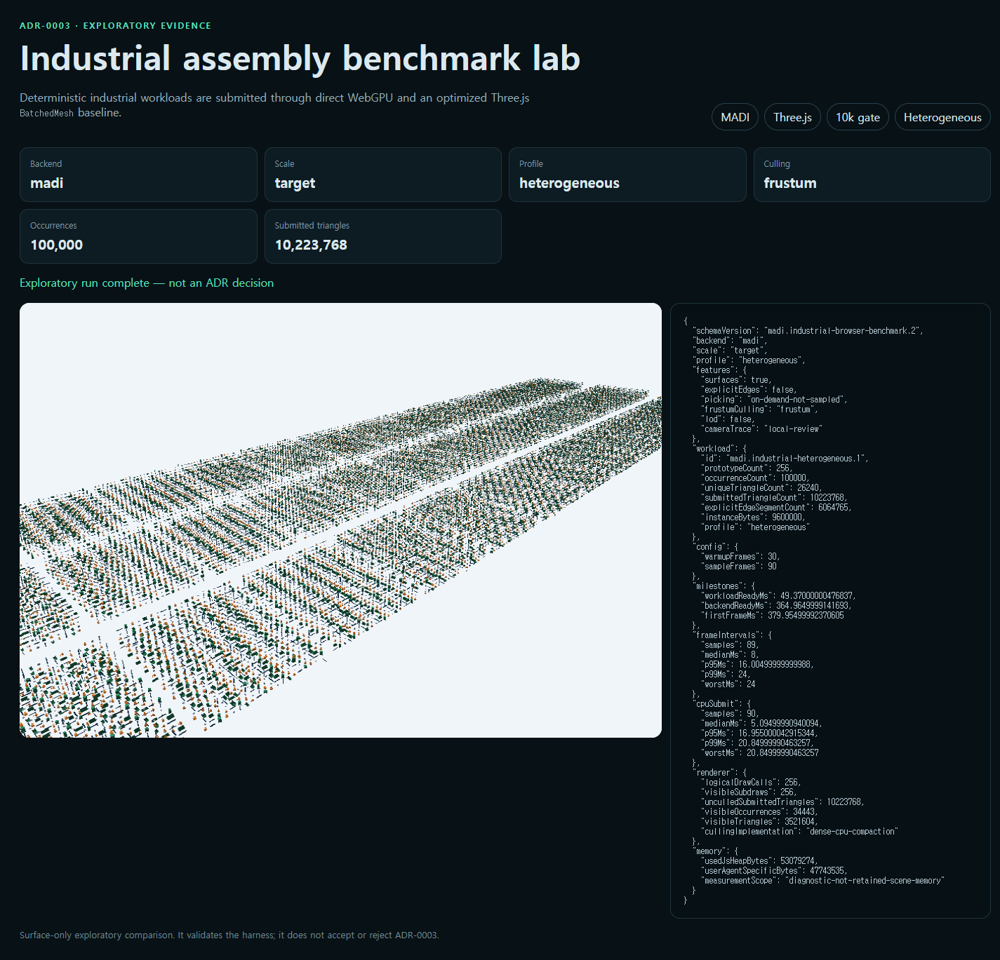
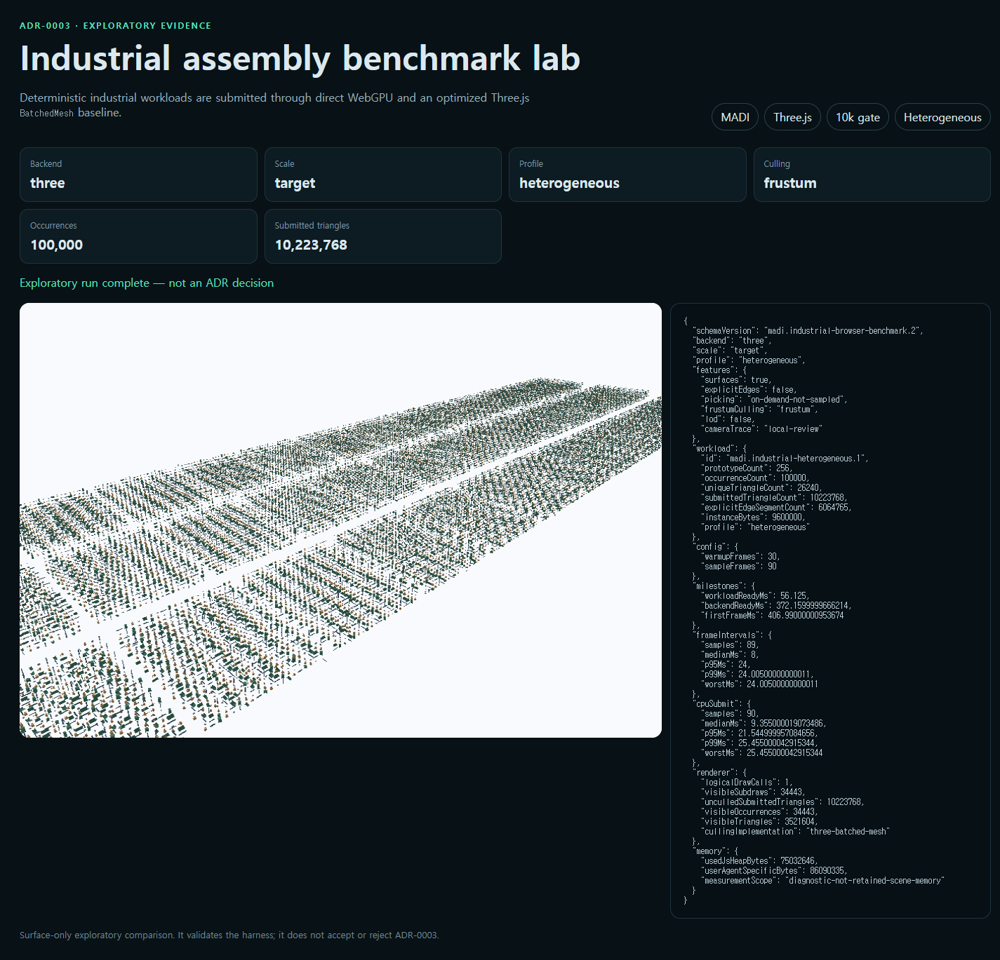

# Exploratory heterogeneous culling target

Status: `exploratory-not-adr-decision`

This record advances ADR-0003 from four highly reused prototypes to 256
deterministic equipment variants, 100,000 occurrences, and 10,223,768 unculled
submitted triangles. A local-review camera trace leaves about 34% of the scene
visible in the final frame. Both paths render the same generated geometry,
transforms, colors, camera, viewport, and surface-only feature contract.

MADI extracts WebGPU frustum planes into reused typed arrays, writes visible
occurrence indices into dense per-prototype tables, and compacts those instances
into reusable upload storage. The optimized Three.js 0.180.0 baseline uses one
`BatchedMesh` with per-object frustum culling and its default opaque sorting.

| Browser | Backend | CPU submit median | CPU submit p95 | Frame interval p95 | First frame |
|---|---|---:|---:|---:|---:|
| Chrome 151 | MADI | 5.090 ms | 16.955 ms | 16.005 ms | 380.0 ms |
| Chrome 151 | Three.js | 9.360 ms | 21.545 ms | 24.000 ms | 407.0 ms |
| Firefox 150 | MADI | 5.700 ms | 19.300 ms | 18.580 ms | 420.7 ms |
| Firefox 150 | Three.js | 9.680 ms | 24.500 ms | 25.020 ms | 576.9 ms |

Chrome reported 45.5 MiB for MADI and 82.1 MiB for Three.js through
`measureUserAgentSpecificMemory()`. Those whole-page values include application
modules and browser-managed data; they are diagnostic, not retained scene-memory
measurements and therefore do not satisfy the ADR memory threshold.

MADI still submits up to 256 prototype draws while `BatchedMesh` exposes one
logical batched path containing 34,443 visible subdraws in Chrome. There are no
GPU timestamp queries, repeated clean
sessions, integrated-GPU results, LOD, streaming, or real partner assembly in
this record. The numbers select the next experiment; they do not accept or
reject ADR-0003.





## Reproduce

```sh
pnpm benchmark:heterogeneous
pnpm benchmark:heterogeneous:check
```

`industrial-benchmark.json` records exact browser versions, adapter disclosure,
90 measured frames per path, screenshot hashes, local-only network evidence,
and the non-decision status.
