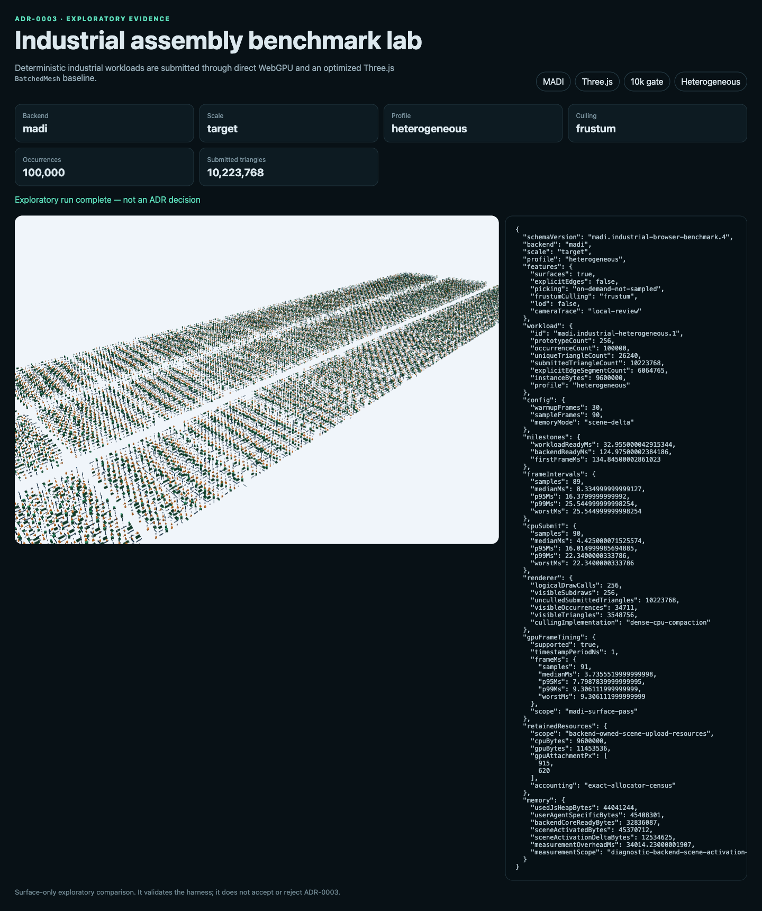
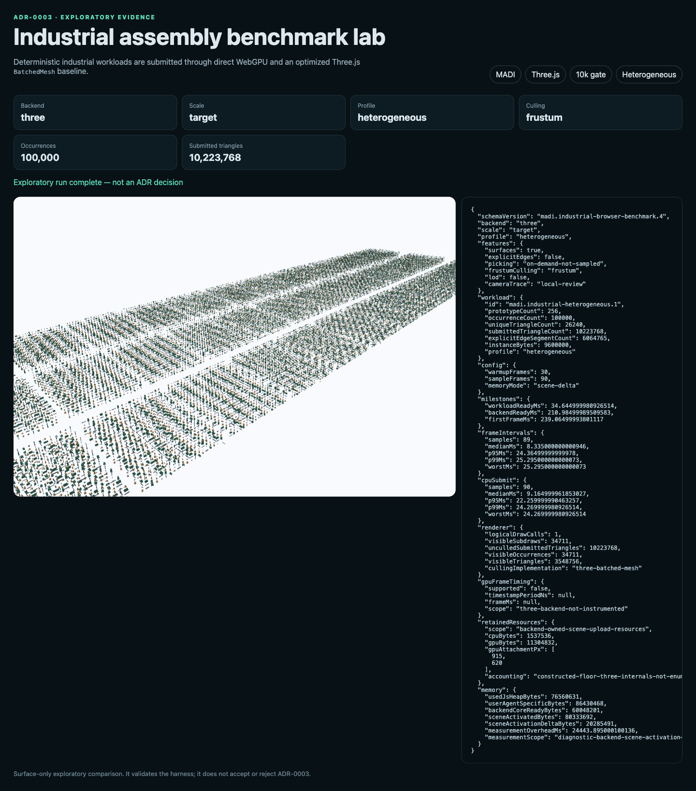

# Apple Silicon integrated-GPU timing record

Status: `exploratory-not-adr-decision`

This is the integrated-GPU companion to
`../heterogeneous-gpu-timing/`. It runs the same 100,000-occurrence,
256-prototype heterogeneous culling workload in twelve fresh headed browser
processes: MADI and Three.js, three repeats each in Chrome 151 and Firefox 150,
with backend order alternating between repeats.

Host: Apple M4 Pro with a 20-core integrated GPU, macOS 15.6 arm64, on AC power.
The run was uninterrupted; ambient thermal state was not instrumented. Browser
adapter disclosure reports Apple `metal-3`, non-fallback. Captured 2026-08-24.

| Browser | Backend | CPU submit p95 median (range) ms | Frame p95 median ms | GPU pass p95 ms | Census CPU / GPU MiB | Scene delta median MiB |
|---|---|---:|---:|---:|---|---:|
| Chrome 151 | MADI | 16.880 (16.015–17.620) | 16.660 | 7.799 | 9.16 exact / 10.92 exact | 11.95 |
| Chrome 151 | Three.js | 22.410 (22.260–23.470) | 24.365 | unsupported | 1.47 floor / 10.78 floor | 19.29 |
| Firefox 150 | MADI | 22.000 (19.920–22.120) | 17.240 | 7.711 | 9.16 exact / 10.92 exact | unavailable |
| Firefox 150 | Three.js | 21.460 (21.260–21.600) | 24.980 | unsupported | 1.47 floor / 10.78 floor | unavailable |

## What this run says

- Chrome's paired CPU-p95 reduction has a 28.1% median and crosses the 25%
  continuation threshold in two of three pairs. Its scene-activation delta is
  38.0% lower in all three pairs, and frame p95 is lower in every pair.
- Firefox does not reproduce the CPU-p95 advantage on this host: its paired
  median is a 3.1% regression and none of the three pairs crosses 25%. Its frame
  p95 is no more than 10% worse in all pairs, with two materially faster MADI
  repeats and one near-equal pair.
- MADI's measured surface-pass GPU p95 median is 7.799 ms in Chrome and 7.711 ms
  in Firefox. The same pass was sub-millisecond on the discrete Windows host,
  so absolute GPU timing is host-specific and cannot be generalized from either
  record alone.
- The record satisfies the requested Apple-Silicon integrated profile, but it
  does not accept ADR-0003. Cross-browser CPU behavior diverges, and the public
  industrial assembly, equivalent explicit-edge path, bounded-residency path,
  and further reference-hardware sessions remain outstanding.





## Reproduce

```sh
pnpm --filter @madi/runtime-webgpu run build
pnpm exec playwright install chromium firefox
pnpm benchmark:gpu-timing:integrated
pnpm benchmark:gpu-timing:integrated:check
```

`industrial-benchmark.json` contains all twelve runs, per-frame distributions,
adapter disclosure, retained-resource accounting, outbound-request evidence,
screenshot hashes, and the paired threshold counts quoted above.
