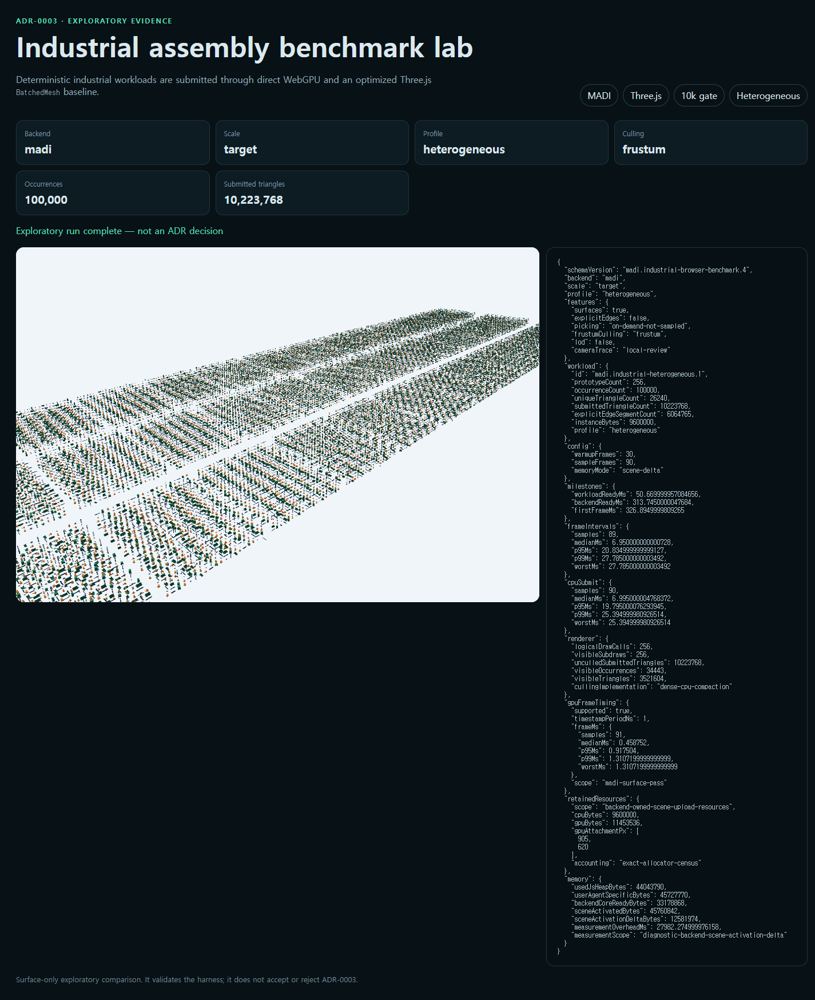
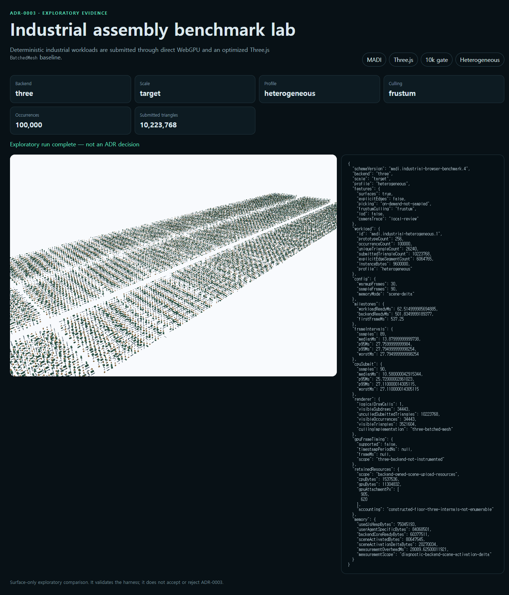

# Heterogeneous GPU timing and retained-resource census record

Status: `exploratory-not-adr-decision`

This record extends the repeated 100,000-occurrence, 256-prototype
heterogeneous culling comparison with two new decision-quality signals:

1. **GPU pass timestamps** through WebGPU `timestamp-query`, attached to the
   MADI surface pass and resolved once after sampling. Chrome 151 and Firefox
   150 both exposed the feature on this host with a one-nanosecond adapter
   period. The Three.js `WebGPURenderer` command encoding is not
   caller-instrumentable, so its runs report GPU timing as unsupported rather
   than substituting wall-clock numbers.
2. **Backend-owned retained-resource census.** MADI reports the exact sum of
   its live `GPUBuffer` allocations plus CPU instance staging. Three.js
   reports a constructed floor from the arrays and reservations the backend
   itself creates, because its internal sort structures, uniforms, and render
   targets are not enumerable. The census attributes where scene memory lives;
   the browser-wide scene-activation delta remains the honest total-memory
   comparison.

Every path launches a fresh browser process, three repeats per browser/backend,
alternating backend order, 90 sampled frames after 30 warmup frames. Warmup
frames are excluded from timing by resetting the query ring before sampling.

Host: Windows x64, NVIDIA Lovelace discrete adapter (see `industrial-benchmark.json`
for the exact adapter disclosure and screenshot hashes). Captured 2026-08-23.

| Browser | Backend | CPU submit p95 median (range) ms | Frame p95 median ms | GPU pass p95 ms | Census CPU / GPU MiB | Scene delta median MiB |
|---|---|---:|---:|---:|---|---:|
| Chrome 151 | MADI | 19.185 (17.030–19.795) | 20.825 | 0.852 | 9.16 exact / 10.92 exact | 11.93 |
| Chrome 151 | Three.js | 25.720 (25.200–25.745) | 27.750 | unsupported | 1.47 floor / 10.78 floor | 19.33 |
| Firefox 150 | MADI | 18.760 (16.600–24.000) | 20.820 | 0.864 | 9.16 exact / 10.92 exact | unavailable |
| Firefox 150 | Three.js | 22.980 (22.640–23.640) | 20.840 | unsupported | 1.47 floor / 10.78 floor | unavailable |

## What the new signals say

- The MADI GPU surface pass is **sub-millisecond**: median 0.459 ms in Chrome
  and 0.297 ms in Firefox, worst observed 1.311 ms. At this scale the frame
  budget is dominated by CPU submit and display cadence, not GPU raster work.
  Any renderer decision at this tier is therefore a CPU-side decision; the
  GPU pass has more than an order of magnitude of headroom.
- GPU scene-upload bytes are nearly identical by construction (both backends
  upload the same ~10.8–10.9 MiB of vertex/index/instance data). The memory
  difference lives on the CPU side: MADI retains 9.16 MiB of exact instance
  staging, while the Three.js floor shows only 1.47 MiB of enumerable arrays —
  its true retained total is higher than its floor, which is why the
  browser-wide delta (38.3% MADI advantage, all three Chrome pairs) remains
  the comparative memory signal.
- Paired CPU-p95 reduction this session has a 23.9% median in Chrome and
  18.4% in Firefox, crossing the 25% gate in one of three pairs per browser.
  The previous repeatability session measured a 27.0% Chrome median crossing
  in two of three pairs. Session-to-session variance is material and is
  exactly why the ADR contract demands multiple hosts and repeats; neither
  session alone decides anything.

This record still does not accept ADR-0003. The integrated-GPU profile, a
redistributable industrial assembly, explicit-edge and bounded-residency
slices, and isolated memory tiers remain outstanding.





## Reproduce

```sh
pnpm benchmark:gpu-timing
pnpm benchmark:gpu-timing:check
```

`industrial-benchmark.json` contains all twelve runs, per-frame GPU pass
distributions, timestamp periods, census values, threshold counts, screenshot
hashes, and zero-outbound-request evidence.

## Integrated-GPU profile procedure (macOS Apple Silicon)

ADR-0003 requires reproduction on at least one integrated-GPU profile. An
Apple-Silicon MacBook qualifies (SoC-integrated GPU with unified memory) and
is recorded as `integrated (high-end)` because M-class GPUs exceed typical
integrated parts.

On the MacBook, with Node.js 22.12+, pnpm 11, and a stable system Chrome:

```sh
git clone https://github.com/1n01raymond/madi.git
cd madi
git switch <the branch or main revision carrying this harness>
pnpm install
pnpm exec playwright install chromium firefox
pnpm benchmark:gpu-timing:integrated
pnpm benchmark:gpu-timing:integrated:check
```

Then commit `artifacts/benchmarks/heterogeneous-gpu-timing-integrated/` so the
discrete and integrated records are reviewable side by side. Recording
disciplines: plug into power, let the machine sit idle briefly before
starting, keep the twelve sequential sessions uninterrupted, and note the
ambient thermal state in the commit message. The record's own adapter
disclosure identifies the Apple GPU; do not compare absolute frame times
across hosts — only threshold outcomes reproduce.
