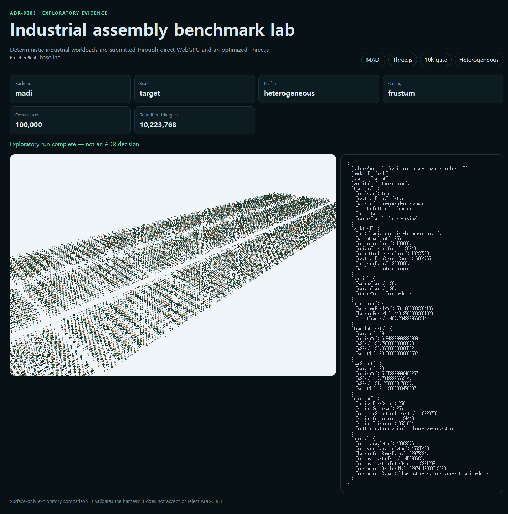
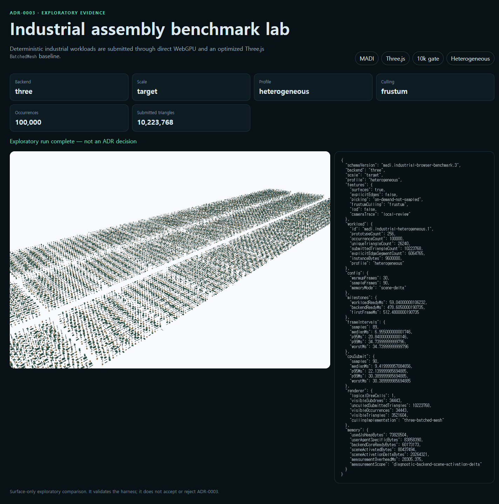

# Heterogeneous repeatability record

Status: `exploratory-not-adr-decision`

This record repeats the 100,000-occurrence, 256-prototype heterogeneous culling
comparison three times in headed Chrome and Firefox. Every path launches a fresh
browser process. Odd repeats run MADI before Three.js and the even repeat reverses
that order. Each run collects 90 CPU samples after 30 warmup frames; only the
first repeat retains screenshots.

| Browser | Backend | CPU submit p95 median (range) | Frame p95 median | Scene activation delta median (range) |
|---|---|---:|---:|---:|
| Chrome 151 | MADI | 17.130 ms (16.750–17.785) | 13.910 ms | 11.91 MiB (11.91–12.32) |
| Chrome 151 | Three.js | 23.465 ms (22.140–26.195) | 20.840 ms | 19.33 MiB (19.26–19.33) |
| Firefox 150 | MADI | 20.460 ms (15.440–20.800) | 20.840 ms | unavailable |
| Firefox 150 | Three.js | 23.100 ms (22.480–23.940) | 20.840 ms | unavailable |

The paired Chrome CPU-p95 reduction has a 27.0% median and a 19.7–36.1% range;
two of three pairs cross the ADR's 25% threshold. Chrome scene-activation delta
is 38.2% lower at the median with a 36.2–38.4% range, crossing the diagnostic
30% threshold in all three pairs. MADI frame p95 is never more than 10% worse.

Firefox is less conclusive: paired CPU-p95 reduction has a 10.0% median and a
9.0–35.5% range, crossing 25% in one of three pairs. Firefox does not expose
`measureUserAgentSpecificMemory()`, so no scene delta is reported there.

The memory delta is measured with the generated workload retained, from a
backend-ready shell to the first rendered scene. Measurement overhead is
recorded and excluded from startup/frame metrics; warmup follows the memory
probe. The value remains browser-wide diagnostic memory and does not count GPU
allocations or replace an allocator-level retained-memory census.

These repeats strengthen the case for continuing measurement, but they do not
accept ADR-0003. Browser behavior is not yet consistent, the run uses one host,
and integrated-GPU, GPU timestamp, bounded-residency, and real industrial-model
evidence are still absent.





## Reproduce

```sh
pnpm benchmark:repeatability
pnpm benchmark:repeatability:check
```

`industrial-benchmark.json` contains all twelve runs, execution order, adapter
disclosure, raw per-run distributions, aggregate ranges and standard deviations,
threshold counts, screenshot hashes, and zero-outbound-request evidence.
