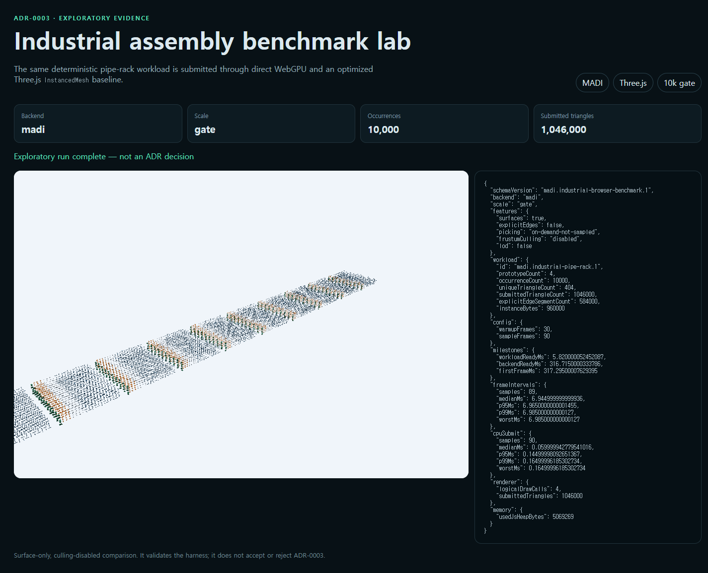
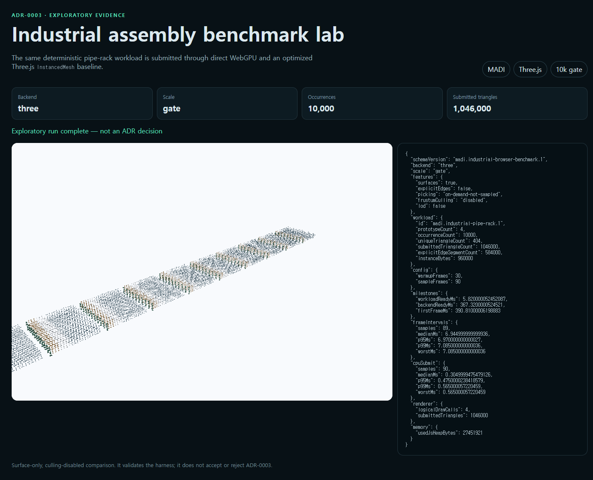

# Exploratory industrial browser baseline

Status: `exploratory-not-adr-decision`

This record proves that one deterministic plant-style workload can be submitted
through MADI direct WebGPU and Three.js WebGPURenderer 0.180.0 with the same
camera trace, viewport, four prototypes, 10,000 occurrences, and 1,046,000
submitted triangles. Headed Chrome/Blink and Firefox/Gecko completed without
console warnings, errors, or HTTP requests outside the local static origin.

| Browser | Backend | CPU submit p95 | Frame interval p95 | First frame |
|---|---|---:|---:|---:|
| Chrome 151 | MADI | 0.145 ms | 6.965 ms | 317.3 ms |
| Chrome 151 | Three.js | 0.475 ms | 6.970 ms | 390.8 ms |
| Firefox 150 | MADI | 0.140 ms | 6.960 ms | 308.6 ms |
| Firefox 150 | Three.js | 0.860 ms | 6.960 ms | 549.0 ms |

These numbers are not a renderer claim. The scene has only four heavily reused
prototypes; surfaces are enabled while explicit edges, culling, LOD, streaming,
and navigation-time picking are disabled. Frame cadence is tied to the local
144 Hz display and there are no WebGPU timestamp queries. Chrome heap snapshots
also include different application module footprints, so they are diagnostic
only.





## Reproduce

```sh
pnpm benchmark:industrial -- --output output/playwright/industrial-benchmark --scale gate --frames 90 --warmup 30
pnpm benchmark:industrial:check
```

`industrial-benchmark.json` records exact browsers, GPU adapter disclosure,
workload contract, samples, screenshot hashes, and the non-decision status.
