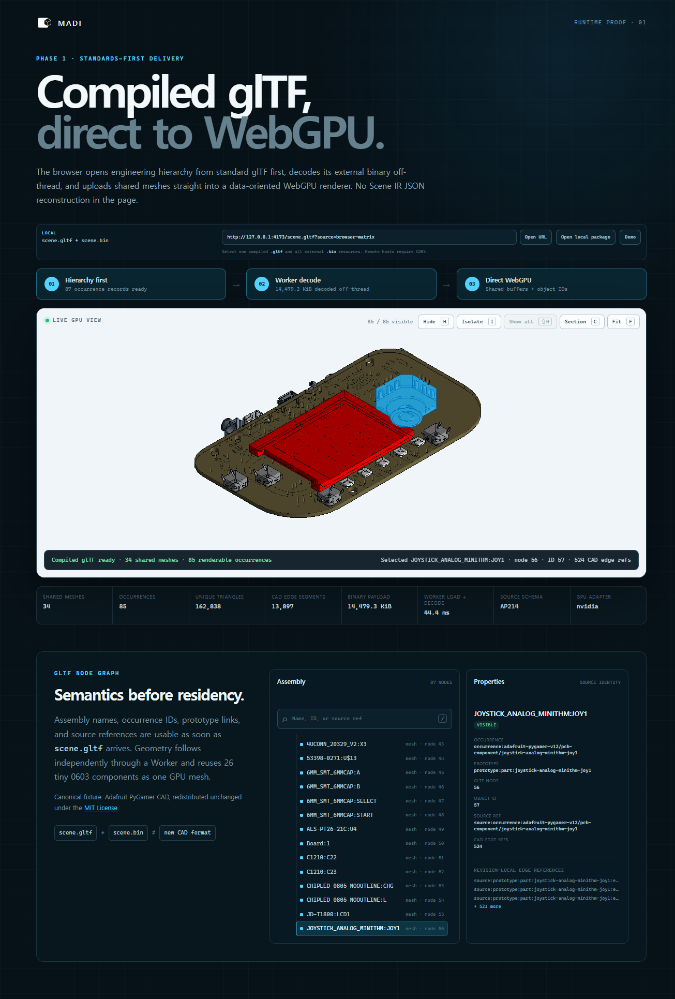
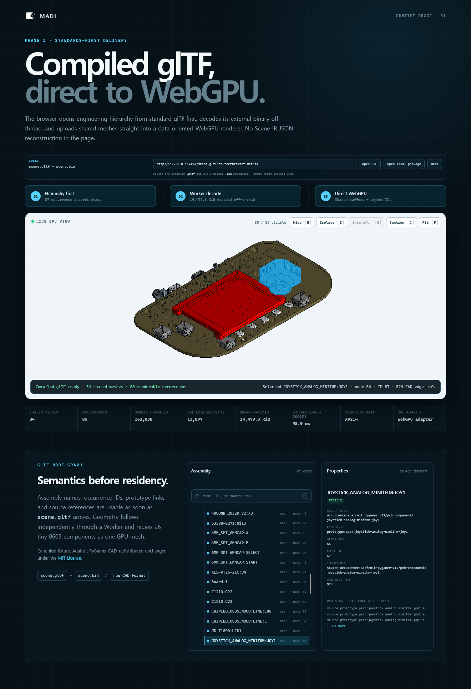
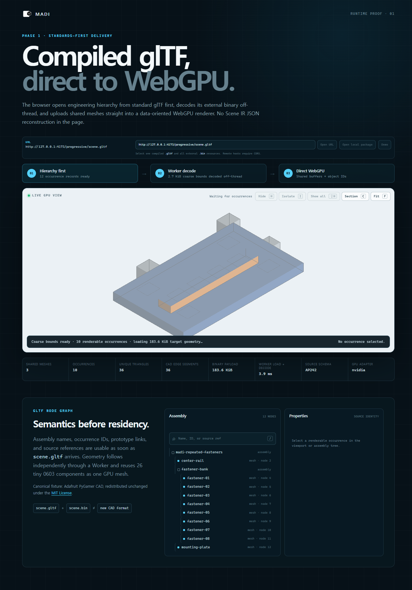
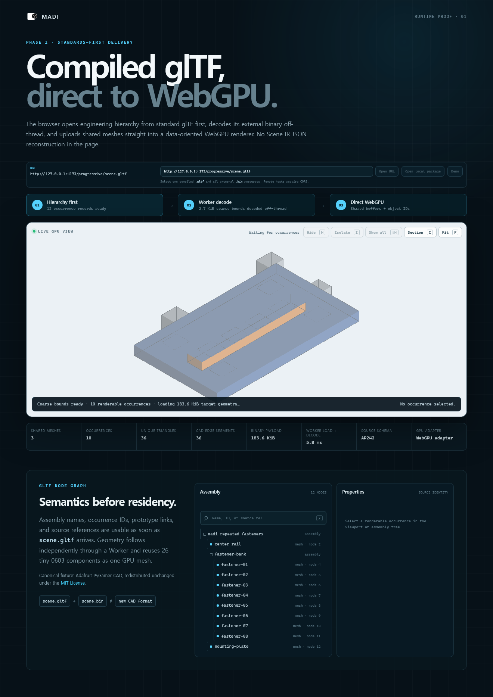
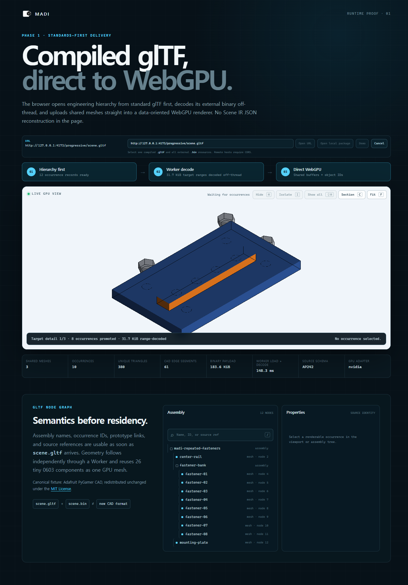
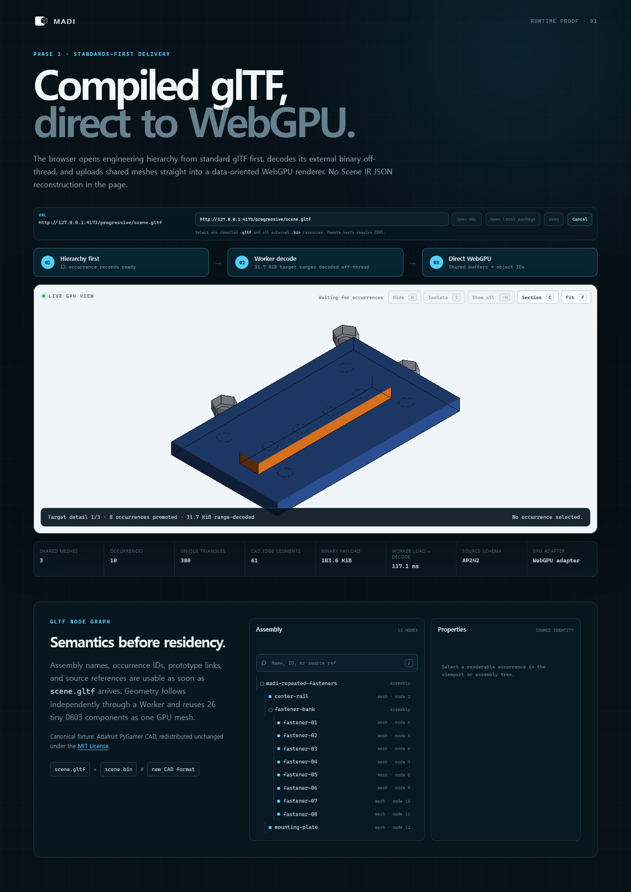

# Phase 1 compiled glTF browser matrix

This evidence records the canonical Adafruit PyGamer STEP fixture loaded,
rendered, and picked through two independent browser engines on 2026-08-23
(Asia/Seoul). `browser-matrix.json` is the machine-readable result; the PNG
files are full-page selection, coarse, and mixed-residency captures referenced
by that report.

The CAD asset is copyright Adafruit Industries and redistributed unchanged
under the MIT License. Adafruit does not endorse MADI.

## Result

| Signal | Chrome | Firefox |
|---|---|---|
| Browser / engine | 151.0.7922.139 / Blink | 150.0.2 / Gecko |
| Host | Windows x64 | Windows x64 |
| Public adapter info | NVIDIA, Lovelace, non-fallback | Vendor fields withheld by the browser, non-fallback |
| Delivery path | `scene.gltf` hierarchy → Worker `scene.bin` decode → WebGPU | Same |
| Hierarchy before binary request | Passed | Passed |
| Coarse frame before delayed target | 36 triangles / 36 edges, passed | Same |
| First target Range promoted | 31.7 KiB; 8 detailed fasteners with retained coarse plate/rail | Same |
| Mixed frame | 380 triangles / 61 edges, passed | Same |
| Target promotion | 2,076 triangles / 181 edges, passed | Same |
| Cancel during range 2/3 | Active request aborted; range 3/3 not requested | Same |
| Ready state | 34 shared meshes, 85 renderable occurrences | Same |
| Geometry | 162,838 triangles, 13,897 explicit CAD edge segments | Same |
| Pick result | PyGamer joystick, glTF node 56, object ID 57, 524 CAD edge refs | Same |
| Fixture license link | Pinned MIT notice present | Same |
| Console warnings / errors | 0 / 0 | 0 / 0 |

| Chrome 151 / Blink | Firefox 150 / Gecko |
|---|---|
|  |  |

| Chrome 151 delayed-target coarse frame | Firefox 150 delayed-target coarse frame |
|---|---|
|  |  |

| Chrome 151 first target Range | Firefox 150 first target Range |
|---|---|
|  |  |

All screenshots were visually reviewed for the canonical camera, source
colors, recognizable display/joystick/button assembly, explicit CAD edges,
hierarchy, statistics, and selected-occurrence text. Minor browser font
rasterization differences are not geometry differences. This run proves the
compiled-package runtime boundary and one AABB-to-target progressive slice, not
shape-preserving LOD, camera-driven chunk priority, bounded residency,
large-scene performance, or broad GPU/OS/mobile support.

## Reproduce

The recorder starts and stops its own Vite server, uses a fixed 1320 × 1000 CSS
viewport, confirms that all 87 hierarchy records are available before the
14.8 MB canonical binary request, and verifies three exact 206 Range responses
for the progressive AP242 package with coarse and mixed frames before final
target residency. A separate run cancels during range 2/3 and asserts that no
later request starts. It selects the joystick at a fixed normalized point,
rejects browser warnings/errors, and writes screenshots plus SHA-256 metadata.

```sh
pnpm install
pnpm exec playwright install firefox
pnpm browser:matrix
```

The default destination is ignored `output/playwright/browser-matrix` storage.
Maintainers intentionally publish a reviewed run with:

```sh
pnpm browser:matrix -- --output artifacts/browser-matrix
```

The Chrome channel must be installed on the host. Use `--headless` only as an
additional diagnostic; it does not replace the headed visual record.

Real Safari is recorded separately through macOS SafariDriver rather than a
Playwright WebKit substitute. See `../browser-safari/README.md` for the current
default-settings capability result.
