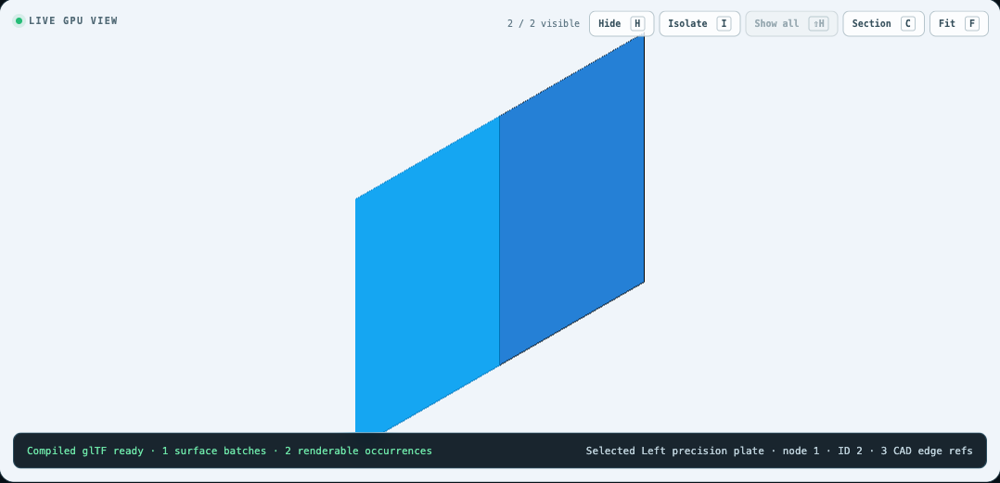
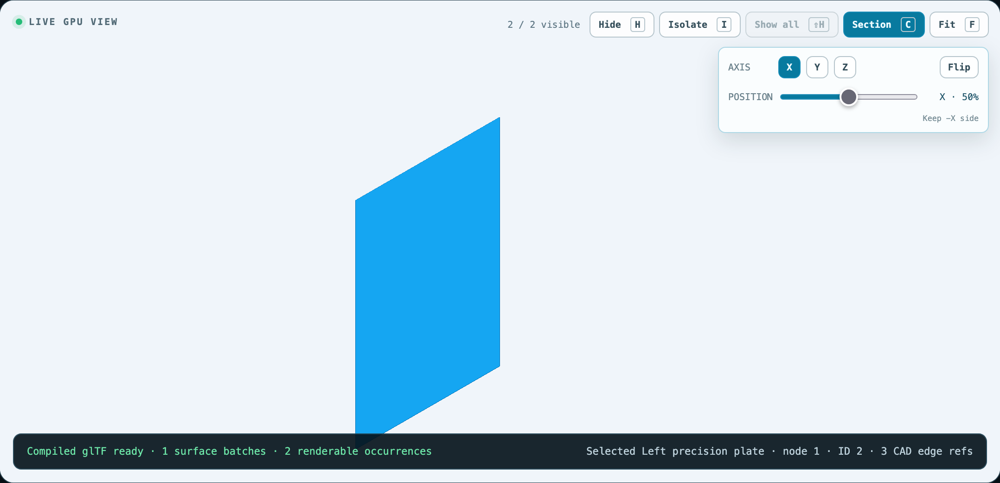

# ADR-0005 large-coordinate precision evidence

This record compares one project-owned pair of 40 mm × 60 mm plates separated
by a 0.25 mm gap near the origin and at a world offset of
`[10,000,000, -7,000,000, 3,000,000]` metres. The two packages share the same
local f32 geometry. Only their occurrence translations differ.

## Result

| Signal | Near origin | 10,000 km offset | Gate |
|---|---:|---:|---|
| Compiled gap | 0.249999613 mm | 0.249999613 mm | ≤ 0.001 mm absolute error, passed |
| Naive f32 gap | 0.249999613 mm | −40 mm (both centres collapse) | Demonstrates the untreated failure |
| Khronos glTF validation | 0 errors / 0 warnings | 0 errors / 0 warnings | Passed |
| Headed Chrome 151 | Initial, navigated, sectioned | Same | 0 px near/far drift; pick ID 2 retained |
| Headed Firefox 150 | Initial, navigated, sectioned | Same | 0 px near/far drift; pick ID 2 retained |
| Browser console issues | 0 | 0 | Passed |

The compiler retains translations whose f32 conversion would exceed the 10 nm
delivery budget. The runtime composes node transforms in JavaScript number
precision, stores each instance translation as f32 high/low components, and
subtracts a high/low camera origin before projection. The existing 96-byte
instance stride is unchanged because the low component occupies its previous
12-byte alignment gap. Section planes are rebased into the same camera-relative
frame, and the object-ID pass uses the identical vertex path.

| Chrome 151 / near | Chrome 151 / 10,000 km |
|---|---|
|  |  |

| Firefox 150 / near | Firefox 150 / 10,000 km |
|---|---|
|  |  |

`evidence.json` pins the host, browser versions, package/resource digests,
Khronos validation counts, measurements, pick identity, console policy, and all
12 screenshot digests. `pnpm precision:check` independently validates those
claims and the committed files.

This is tessellated display and transform precision evidence, not source-exact
B-Rep measurement or broad device conformance. Real Safari 18.6 on this host
does not expose `navigator.gpu` under default settings, so its existing
capability record remains an unsupported-browser result rather than rendering
evidence.

## Reproduce

Install desktop Chrome and Firefox, then run the headed recorder on Apple
Silicon:

```sh
pnpm precision:evidence -- --output artifacts/precision/large-coordinates
pnpm precision:check
```

The default recorder destination is the ignored
`output/coordinate-precision/` directory. `--headless` and `--browser=chrome`
or `--browser=firefox` are diagnostic options; the committed ADR record requires
both headed engines.
