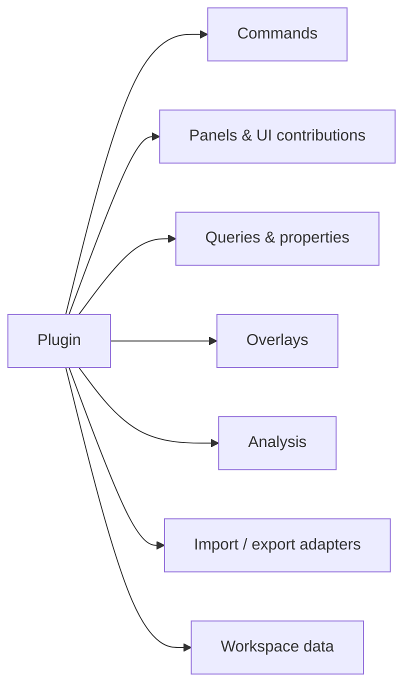

# Plugin and Automation Architecture

Status: Draft 0.1

## 1. Goal

NARU should become useful in domains the core maintainers do not understand.
Plugins allow organizations and communities to add importers, queries, tools,
panels, overlays, analysis, and workflow automation without forking the runtime.

The design favors explicit capabilities, versioned contracts, deterministic
document transactions, and self-hosted distribution.

## 2. Extension surfaces



### Initial supported contributions

- commands and keyboard/menu metadata;
- inspector tabs and dockable panels in Studio;
- property providers and semantic queries;
- selection-aware analysis results;
- bounded GPU/DOM overlays;
- workspace data with schema/migrations;
- source resolver and import adapter registration in trusted hosts.

### Deferred contributions

- arbitrary render-pipeline replacement;
- unrestricted shader injection;
- native code downloaded and executed by the browser;
- background network access without host capability;
- silent modification of source CAD documents.

## 3. Manifest

```json
{
  "id": "org.example.clearance-check",
  "name": "Clearance Check",
  "version": "0.1.0",
  "naru": ">=0.3.0 <0.4.0",
  "entry": "./dist/browser.js",
  "capabilities": [
    "scene.read",
    "selection.read",
    "workspace.write:org.example.clearance-check",
    "overlay.write",
    "worker.compute"
  ],
  "contributes": {
    "commands": ["clearance.run"],
    "panels": ["clearance.results"]
  }
}
```

Manifests declare compatibility before code executes. Hosts can deny optional
capabilities or refuse the plugin.

## 4. Capability model

Candidate capabilities:

```text
scene.read
scene.properties.read
selection.read
selection.write
visibility.write
workspace.read
workspace.write:<namespace>
overlay.write
network.fetch:<origin-pattern>
local-files.read:user-selected
worker.compute
adapter.register
export.write:user-selected
```

Capabilities are objects passed to activation, not global booleans. Revocation
invalidates the object and aborts outstanding operations.

## 5. Lifecycle

```ts
export interface NaruPlugin {
  activate(context: PluginContext): Promise<void> | void;
  deactivate(): Promise<void> | void;
}

interface PluginContext {
  pluginId: string;
  subscriptions: DisposableStore;
  commands: CommandCapability;
  scene?: ReadSceneCapability;
  workspace?: NamespacedWorkspaceCapability;
  overlays?: OverlayCapability;
  ui?: StudioUiCapability;
  workers?: ComputeCapability;
}
```

All registrations return disposables. Deactivation is bounded and the host
forcibly releases remaining contributions/resources.

## 6. Transactions

Core and workspace mutations occur through transactions:

```ts
await workspace.transact("Create inspection view", tx => {
  tx.views.create(view);
  tx.selectionSets.create(set);
  tx.pluginData.set("org.example.inspection", data);
});
```

Transactions provide validation, undo/redo metadata, plugin attribution,
events, and future collaboration compatibility. Plugins cannot mutate decoded
tables or GPU state directly.

## 7. UI integration

The plugin SDK defines logical contributions rather than requiring one UI
framework. Studio may initially support web components or sandboxed iframe
panels plus command/selection services.

Requirements:

- theme and accessibility tokens;
- focus/keyboard integration;
- panel lifecycle and saved layout;
- no access to host DOM outside the plugin root;
- clear loading/error/permission states;
- per-plugin CPU/memory diagnostics where feasible.

## 8. Worker and analysis plugins

Heavy computation uses host-managed Workers. Plugins provide module entry
points or tasks; the host controls concurrency, memory, cancellation, and data
transfer. Scene data access is paged or explicitly copied, preventing accidental
transfer of an entire massive model.

Analysis results include:

- source/model revision inputs;
- algorithm/plugin version;
- approximation and tolerances;
- generated entities/overlays;
- invalidation dependencies.

## 9. Adapter plugins

Source adapters are higher trust than ordinary UI plugins. Native/proprietary
adapters normally run in compiler processes or private services, not as browser
plugins. The public contract lets a host register:

- source probe and metadata;
- compile job submission/status;
- generated manifest resolution;
- source identity and exact-query services.

Credentials stay in host-managed secret storage.

## 10. Distribution

The core supports:

- local development plugins;
- host-configured URLs with integrity hashes;
- self-hosted registries;
- bundled first-party plugins.

A public marketplace is not required initially. Code signing, review, and
revocation policy are designed before any official registry accepts uploads.

## 11. API stability

- Plugin API uses semantic versions and feature detection.
- Experimental namespaces are explicitly labeled and may change in minor
  pre-1.0 versions.
- Plugins declare ranges; Studio explains incompatibility without attempting
  unsafe activation.
- Workspace plugin data is namespaced and migrated by the owning plugin.
- Removed plugins leave opaque data intact unless the user asks to clean it.

## 12. Security

Browser plugins are not assumed trustworthy merely because they are open
source. Controls include:

- integrity-pinned modules;
- capability grants;
- sandboxed UI where practical;
- host fetch proxy and origin policy;
- no ambient credentials;
- bounded Workers and overlay resources;
- audit log for workspace transactions;
- safe mode that opens a project without plugins.

## 13. Example plugin opportunities

- fastener classification and count;
- BOM reconciliation;
- clearance and clash checks;
- model revision visual comparison;
- IFC property workbench;
- machine maintenance overlays;
- drawing/view generation;
- PLM/PDM links;
- quality inspection annotations;
- agent tools that query selected engineering context.
